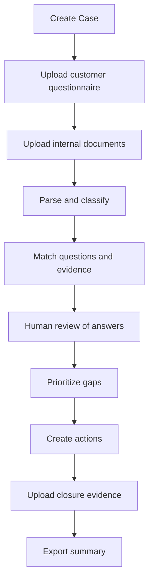
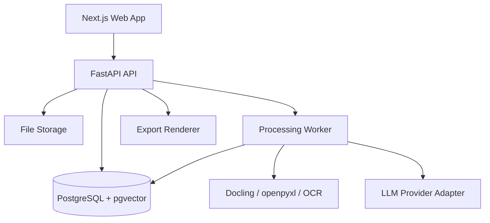
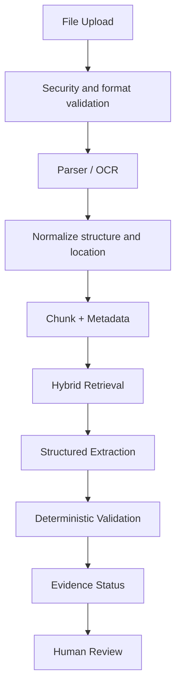

<!-- Phase 0 document-control banner. Added by the documentation-only Phase 0 bootstrap commit. -->

## Document Control Banner

| Field | Value |
|---|---|
| Status | **PROPOSED** |
| Gate P0 | **BLOCKED** |
| Version of the text below | **v1.0** (unchanged) |
| Main Spec target | **v1.1 — NOT ACCEPTED** |
| Contract target | **v1.1.0 — NOT FROZEN** |
| Feature implementation | **NOT AUTHORIZED** |
| Normative status | **NORMATIVE.** This English document is the normative Main Technical Spec. |
| Translation | `BuktiESG-Technical-Spec-ZH.md` is a **non-normative** translation. Where the two conflict, **this English document governs**. |

**The body below is unchanged v1.0 text.** Proposed amendments `SPEC-AMD-001` through `SPEC-AMD-008` are recorded in [`AMENDMENTS.md`](AMENDMENTS.md) and are **deliberately not applied here**. Do not read this document as v1.1. Main Spec v1.1 does not exist until the CEO, COO, and Ground-Truth Approver have signed each amendment individually.

Related: [`AMENDMENTS.md`](AMENDMENTS.md) · [`Shared-Integration-Contract-v1.1.0-PROPOSED.md`](Shared-Integration-Contract-v1.1.0-PROPOSED.md) · [`../decisions/decision-register.md`](../decisions/decision-register.md) · [`../decisions/GATE-P0-APPROVAL.md`](../decisions/GATE-P0-APPROVAL.md)

---

# BuktiESG Technical Specification

> Product positioning: An ESG customer-questionnaire Evidence-to-Action workspace for Malaysian SMEs  
> Document purpose: A unified execution baseline for product, design, development, testing, and demo work by AI Coding Agents  
> Document version: v1.0  
> Date: 2026-08-21  
> Status: `planned`; the Phase 0 confirmation gate must be completed before development begins

---

## 0. Project Control Status

| Item | Current value |
|---|---|
| Project tier | T1: A maintainable, deployable Hackathon/portfolio project; only synthetic or de-identified data may be used |
| Planned build risk | Yellow: Includes file uploads, AI file processing, business scoring rules, a database, and exports |
| Enforcement | Advisory-only: Until CI, protected tests, and acceptance evidence are established in the repository, the project must not claim independent enforcement |
| Production state | Not released |
| Product owner | To be assigned |
| Technical lead | To be assigned |
| Release approver | Product owner; the AI Agent that implements a feature must not approve its own release |

### 0.1 Triggers for Escalation to T2

If any of the following occurs, stop releasing under T1 and first redesign security, privacy, and operations:

- Real employee, customer, payroll, identity-card, health, safety-incident, or other personal data is uploaded;
- Real customers or external businesses depend on system outputs;
- Generated questionnaire answers are used directly for contracts, audits, compliance, or regulatory submissions;
- Accounts, organization isolation, role permissions, or multi-tenancy are required;
- Incorrect answers could cause contractual, financial, reputational, or legal loss.

### 0.2 AI Agent Execution Rules

AI Agents must follow these rules:

1. Read this specification in full before creating code or changing the architecture.
2. Implement, test, and submit evidence for each Phase separately; do not generate the entire system first and test only afterward.
3. Do not change acceptance criteria, scoring formulas, or Ground Truth merely to make tests pass.
4. Do not treat LLM output as Verified Evidence.
5. Do not automatically submit a customer questionnaire; every final answer requires human confirmation.
6. Do not use real sensitive data for development, screenshots, testing, or demos.
7. Before adding a dependency, record its purpose, license, size, security implications, and alternatives.
8. If the same Gate still fails after three consecutive fixes, stop patching and revisit the requirement or design for an incorrect assumption.
9. At the end of each phase, use only `implemented`, `verified`, `accepted`, `blocked`, or `failed`; do not use a vague “done” status.
10. Do not mark `verified` as `accepted` without product-owner acceptance.

---

## 1. Product Overview

### 1.1 One-Sentence Definition

BuktiESG helps Malaysian SMEs without a dedicated ESG team organize the information required for a customer ESG questionnaire within two weeks, determine which answers are evidenced and which are incomplete or conflicting, and turn important gaps into actions with an owner, deadline, and completion evidence.

“Bukti” means evidence or proof in Malay, emphasizing that the product’s purpose is not to generate more text but to establish a trustworthy Evidence Trail.

### 1.2 Target Users

Primary persona:

- Company size: Approximately 20–100 employees;
- Industry: The first version focuses on Malaysian manufacturing; the Demo uses a plastic-packaging manufacturing SME;
- User: Finance/Admin Manager, Operations Manager, HR Manager, or an ESG Coordinator temporarily appointed by management;
- User profile: Familiar with company documents and day-to-day operations, but not an ESG expert;
- Context: The company has received an ESG Questionnaire from a major customer and must respond within 14 days.

### 1.3 Jobs the User Needs to Complete

The user’s real job is not to “obtain an ESG score,” but to:

1. Understand what the customer is asking;
2. Know what information the company currently has;
3. Know what evidence supports each answer;
4. Know which evidence is outdated, insufficient in scope, conflicting, or entirely missing;
5. Know who should provide what before the deadline;
6. Know which operational issues should be improved after the questionnaire is submitted;
7. Produce a concise summary that both management and the customer can understand.

### 1.4 Product Principles

- Evidence first: Find evidence before writing an answer.
- Human approved: AI may suggest, but it cannot make the company’s final declaration.
- Explainable: Every status, priority, and suggestion must include a reason.
- Localized: Use Malaysia’s SEDG Version 2 and Manufacturing Guide as the primary classification references.
- Depth over breadth: The MVP does not attempt to become a complete ESG, carbon-accounting, or audit platform.
- Operational: Every important gap must ultimately be convertible into an owner, next step, deadline, and closure evidence.

---

## 2. Background Standards and References

### 2.1 Primary Classification Standard

The first version uses Capital Markets Malaysia’s SEDG Version 2:

- 3 Pillars: Environmental, Social, Governance;
- 15 Topics;
- 38 Disclosures;
- Three maturity levels: Basic, Intermediate, Advanced;
- Manufacturing-sector supplementary guidance.

Official resources:

- [SEDG Official Website](https://sedg.capitalmarketsmalaysia.com/)
- [SEDG Version 2 PDF](https://sedg.capitalmarketsmalaysia.com/wp-content/uploads/2025/07/SEDG-v2.pdf)
- [SEDG Tutorial Videos](https://sedg.capitalmarketsmalaysia.com/videos/)

### 2.2 International References

The following resources are design references only and should not all be implemented in the MVP:

- [EFRAG VSME Digital Template](https://www.efrag.org/en/vsme-digital-template-and-xbrl-taxonomy): Reference for conditional fields, automatic calculations, consistency checks, and structured output;
- [EcoVadis Methodology](https://support.ecovadis.com/hc/en-us/articles/115002531507-What-is-the-EcoVadis-methodology): Reference for evidence-based assessment and improvement priorities;
- [EcoVadis Corrective Action Plan](https://support.ecovadis.com/hc/en-us/articles/360025780871-How-to-use-the-Corrective-Action-Plan-feature): Reference for actions, due dates, and completion evidence;
- [Sedex Platform](https://www.sedex.com/solutions/sedex-platform/): Reference for the relationship among SAQ, risk, audit, and corrective action.

### 2.3 Important Boundary

SEDG tells SMEs what information to disclose. BuktiESG adds the following operational layer:

- Evidence relationships between documents and questions;
- Evidence quality and gaps;
- Answer readiness;
- Explainable prioritization;
- Ownership and action tracking.

---

## 3. MVP Scope

### 3.1 Must Implement

1. Create a Questionnaire Case and set the customer name and deadline.
2. Upload at least one structured and one unstructured source:
   - Structured: `.xlsx` or `.csv` customer questionnaire;
   - Unstructured: `.pdf`, `.docx`, or scanned file.
3. Extract the question, section, required flag, and customer reference from the questionnaire.
4. Map questions to E/S/G, an SEDG Topic, and an optional Disclosure ID.
5. Find candidate evidence in uploaded documents and save source locations.
6. Display an Evidence Status for each question.
7. Identify Missing, Partial, Outdated, and Conflicting Evidence.
8. Allow users to review, edit, and confirm answers.
9. Calculate priority using a transparent formula and display the factor breakdown.
10. Convert a gap into an Action containing an owner, next step, deadline, status, and closure evidence.
11. Distinguish Submission Actions from Sustainability Improvements.
12. Export a Customer Response Summary, Evidence Index, and Outstanding Action Summary.

### 3.2 Explicit Non-Goals

The following are outside the first version:

- A complete Scope 1, 2, and 3 corporate carbon-accounting platform;
- Automatic submission to customer websites, EcoVadis, Sedex, or CDP;
- Independent third-party ESG Assurance or Certification;
- Multi-tenancy, complex role permissions, SSO, or MFA;
- Real email, Slack, or WhatsApp notifications;
- Automatic modification of complex macros in an original customer Excel template;
- Automatic calculation of all 38 SEDG disclosures;
- Real production integrations with ERP, HRIS, or utility providers;
- Determining from the internet whether a company is “compliant”;
- Replacing item-level evidence analysis with a single black-box overall ESG score.

### 3.3 MVP Success Outcome

Using the Demo Dataset, a non-ESG expert should be able to complete the following within 10 minutes:

- Upload the questionnaire and evidence files;
- Understand overall readiness;
- Find at least one Verified, Partial, Outdated, Conflicting, and Missing item;
- Navigate from an evidence citation back to its source location;
- Create at least three actions with an owner and deadline;
- Export a summary containing evidence statuses and outstanding items.

---

## 4. Core User Flows

### 4.1 Normal Flow



### 4.2 Boundary Flows

- Empty questionnaire: The system must not invent questions; display a remediable error and an example format.
- Scanned PDF without a text layer: Run OCR; if it still fails, mark it `NEEDS_MANUAL_REVIEW`.
- One question maps to multiple files: Preserve multiple Evidence Links; do not force a single selection.
- One file supports multiple questions: Allow the same Evidence Chunk to be reused.
- No evidence exists but AI knows a common answer: It may only return `AI_SUGGESTED`, never `VERIFIED`.
- File date is outside the reporting period: Mark it `OUTDATED` or `PARTIAL`.
- Two files contain different values: Mark them `CONFLICTING`; do not automatically choose the apparently more credible value.
- User deletes a file: Preserve the audit event; invalidate related Evidence Links and recalculate statuses.
- User clicks upload repeatedly: Do not create another file for the same checksum; return the existing processing result.

### 4.3 Failure and Recovery Flows

- Parser failure: Save the failure reason and allow reprocessing or manual entry.
- LLM timeout: Use exponential backoff and retry no more than twice; after failure, retain a recoverable state and do not delete parsed content.
- Embedding failure: The file remains available through keyword search; show the user that functionality is degraded.
- Export failure: Preserve case state and allow re-export.
- Database temporarily unavailable: Fail the request; do not return “saved successfully.”
- Browser refresh: Successfully saved uploads, confirmations, and Actions must not be lost.

---

## 5. Information Architecture and Page Specifications

### 5.1 Page Inventory

| Page | Purpose | Core components |
|---|---|---|
| `/` | Case list and entry point | Case cards, deadline, readiness, Create Case |
| `/cases/new` | Create Case | Company, customer, questionnaire name, deadline, reporting period |
| `/cases/:id/intake` | Upload and process files | Upload zone, file table, processing status, error details |
| `/cases/:id/readiness` | Overview of current position | E/S/G summary, status counts, deadline, priority list |
| `/cases/:id/questions` | Item-level workspace | Filters, question table, status, priority, owner |
| `/cases/:id/questions/:questionId` | View evidence and confirm answer | Question, draft answer, source viewer, evidence cards, decision log |
| `/cases/:id/actions` | Track actions | Submission/Improvement tabs, Kanban/List, owner, deadline |
| `/cases/:id/export` | Generate shareable materials | Include options, validation warnings, export history |

### 5.2 Readiness Dashboard

Must display:

- Days remaining until the deadline;
- Total questions and Required questions;
- Counts of Verified, Partial, Outdated, Conflicting, Missing, and AI Suggested items;
- E/S/G category distribution;
- Top 5 Priority Gaps;
- Number of answers not yet human-confirmed;
- Current Submission Readiness, not an “ESG Performance Score.”

Recommended Submission Readiness:

```text
readiness_percentage = confirmed_required_questions / total_required_questions * 100
```

Only required answers with `HUMAN_CONFIRMED` count toward the numerator. Verified but unconfirmed answers do not count.

### 5.3 Question Detail Page

The same screen, or a clearly associated Drawer, must display:

- Original customer question;
- E/S/G, SEDG Topic, and Disclosure mapping;
- Reporting period and evidence requirement;
- AI Draft Answer;
- Evidence Status and the reason for that status;
- Each evidence item’s filename, page/Sheet/Cell, date, and excerpt;
- “Open source” action;
- Accept, Edit, Reject, and Mark not applicable actions;
- Create Action;
- Decision History.

### 5.4 Visual Rules

- `VERIFIED`: Green, but must also display a citation;
- `PARTIAL`, `OUTDATED`: Amber;
- `CONFLICTING`, `MISSING`: Red;
- `AI_SUGGESTED`: Purple and labeled “Not human-confirmed”;
- Do not rely on color alone; every status must also include an icon and text;
- All interactions support keyboard input;
- At 1366×768, important tables must show question, status, priority, and owner without horizontal scrolling.

---

## 6. Evidence Status Model

### 6.1 Status Enum

```text
VERIFIED
PARTIAL
OUTDATED
CONFLICTING
MISSING
AI_SUGGESTED
NOT_APPLICABLE
NEEDS_MANUAL_REVIEW
```

### 6.2 Status Determination Rules

`VERIFIED` must satisfy all of the following:

1. At least one accessible Evidence Link exists;
2. The Evidence clearly supports the claim in the answer;
3. The reporting period meets the question’s requirement;
4. The company/site/employee scope matches;
5. A numerical value includes an explainable unit;
6. No unresolved high-severity conflict exists;
7. The source location is not empty.

Typical conditions for `PARTIAL`:

- Only 3 months are covered, but the customer requires 12 months;
- Only headquarters is covered, but the customer requires all sites;
- A policy exists, but no implementation record exists;
- A total is available, but the customer-required breakdown is absent.

Default rules for `OUTDATED`:

- If the question has an explicit period, the source is outside that period;
- If the question has no explicit period, the policy’s last approval date is more than 24 months ago, as a provisional MVP threshold;
- The 24-month threshold is a product decision, not a legal conclusion, and the rule source must be shown in the UI.

Typical conditions for `CONFLICTING`:

- Two records for the same metric, scope, and period contain different values;
- A policy claims that a practice exists, but the operational log contains no record of it;
- The employee total differs between the HR sheet and management report.

`MISSING`: No source sufficient to support the claim was found.

`AI_SUGGESTED`: The system generated a possible answer from the question, standard, or existing excerpts, but it does not yet satisfy the Verified conditions.

### 6.3 Minimum Evidence Link Fields

- `document_id`
- `chunk_id`
- `location_type`: page, sheet_cell, paragraph, manual
- `page_number` or `sheet_name + cell_range`
- `quoted_excerpt`
- `source_date`
- `period_start` / `period_end`
- `scope_description`
- `unit`
- `extraction_method`
- `extraction_confidence`
- `created_by`: system or user

Note: `extraction_confidence` measures OCR/extraction quality only; it is not the Evidence Status.

---

## 7. Prioritization Model

### 7.1 Formula

Each factor is scored from 0–5:

```text
priority_score = 7 * impact
               + 5 * urgency
               + 4 * evidence_gap
               + 4 * feasibility
```

Maximum score: 100.

### 7.2 Factor Definitions

| Factor | 0 points | 3 points | 5 points |
|---|---|---|---|
| Impact | Almost no business or ESG impact | Moderate risk/customer concern | Major safety, labor, governance, customer, or environmental impact |
| Urgency | Not required and no near-term deadline | Should be completed before the deadline | Customer-required, blocks submission, or overdue |
| Evidence gap | Complete evidence already exists | Partial/outdated | Completely missing or severely conflicting |
| Feasibility | Cannot be advanced within two weeks | Requires cross-functional coordination | Can be completed by a clear owner within days |

### 7.3 Transparency Requirements

- The UI must display all four factors and the reason for each;
- Users may change a score, but must enter a reason;
- Every change is written to the Activity Log;
- The LLM may suggest factor scores, but the rule engine performs the final calculation;
- Exported reports include the factor breakdown, not only the total score.

### 7.4 Two Action Types

`SUBMISSION`: Collect or confirm information for the current customer response, such as obtaining the missing nine months of electricity bills.

`IMPROVEMENT`: Improve long-term operations, such as establishing a monthly waste register, installing a sub-meter, or updating the anti-bribery training process.

The two action types must be displayed separately so that short-term document collection is not mistaken for sustainability improvement.

---

## 8. Functional Requirements and Acceptance Criteria

### 8.1 Case and Upload

- `REQ-001`: WHEN a user creates a Case and enters the customer, deadline, and reporting period, THE SYSTEM SHALL save the Case and display a unique Case ID.
- `REQ-002`: WHEN a user uploads a supported file, THE SYSTEM SHALL display its filename, type, size, checksum, and processing status.
- `REQ-003`: WHEN the same checksum is uploaded again to the same Case, THE SYSTEM SHALL prevent a duplicate record and link to the existing file.
- `REQ-004`: WHEN the file type or size is unsupported, THE SYSTEM SHALL reject the upload and display allowed types and limits.
- `REQ-005`: WHEN a parser fails, THE SYSTEM SHALL save the error reason and provide retry and manual-entry paths.

### 8.2 Questionnaire Parsing

- `REQ-010`: WHEN an `.xlsx` or `.csv` questionnaire is uploaded, THE SYSTEM SHALL extract question text, section, required flag, and source row/cell.
- `REQ-011`: WHEN a header cannot be identified reliably, THE SYSTEM SHALL ask the user to select the header row and question column, and must not publish a guessed result directly.
- `REQ-012`: WHEN a question is classified, THE SYSTEM SHALL save its E/S/G pillar, SEDG Topic, optional Disclosure ID, and mapping rationale.
- `REQ-013`: WHEN a user changes a mapping, THE SYSTEM SHALL save the human mapping as the current value and preserve the previous value in history.

### 8.3 Evidence and Answers

- `REQ-020`: WHEN the system proposes candidate evidence, THE SYSTEM SHALL display the exact source location and excerpt for each item.
- `REQ-021`: WHEN no source location exists, THE SYSTEM SHALL NOT mark the answer as VERIFIED.
- `REQ-022`: WHEN two records for the same scope/period conflict, THE SYSTEM SHALL mark them CONFLICTING and display both sources.
- `REQ-023`: WHEN evidence covers only part of the required period or scope, THE SYSTEM SHALL mark it PARTIAL and explain the missing coverage.
- `REQ-024`: WHEN evidence is outside the required period, THE SYSTEM SHALL mark it OUTDATED and display the source date and required period.
- `REQ-025`: WHEN AI generates an answer without sufficient evidence, THE SYSTEM SHALL mark it AI_SUGGESTED.
- `REQ-026`: WHEN a user confirms or edits an answer, THE SYSTEM SHALL save the answer, reviewer, timestamp, and used evidence IDs.
- `REQ-027`: WHEN a user rejects an AI Draft, THE SYSTEM SHALL save the rejection reason and must not automatically resubmit the same draft.

### 8.4 Priority and Action

- `REQ-030`: WHEN a question has a gap, THE SYSTEM SHALL display a 0–100 priority score, four factors, and reasons.
- `REQ-031`: WHEN a user changes any factor, THE SYSTEM SHALL recalculate the total and record the reason for the change.
- `REQ-032`: WHEN a user converts a gap into an Action, THE SYSTEM SHALL require the action type, owner, next step, and deadline.
- `REQ-033`: WHEN an Action is marked COMPLETED, THE SYSTEM SHALL require a completion note; if the Action requires evidence, closure evidence is also required.
- `REQ-034`: WHEN closure evidence becomes invalid or is deleted, THE SYSTEM SHALL return the Action to NEEDS_REVIEW and must not leave it unconditionally completed.

### 8.5 Export

- `REQ-040`: WHEN a user requests an export, THE SYSTEM SHALL first display unresolved conflicts, missing required answers, and unconfirmed AI suggestions.
- `REQ-041`: WHEN exporting the Customer Response Summary, THE SYSTEM SHALL distinguish confirmed answers, evidence status, assumptions, and outstanding items.
- `REQ-042`: WHEN exporting the Evidence Index, THE SYSTEM SHALL include question ID, document, location, period, scope, and review status.
- `REQ-043`: WHEN an export fails, THE SYSTEM SHALL not change Case data and shall allow retry.
- `REQ-044`: WHEN a report contains AI Suggested content, THE SYSTEM SHALL display a prominent disclaimer.

### 8.6 Accessibility and Error Handling

- `REQ-050`: WHEN a user operates only with a keyboard, THE SYSTEM SHALL support all major review and Action operations other than uploading.
- `REQ-051`: WHEN the UI uses status colors, THE SYSTEM SHALL also display text and an icon.
- `REQ-052`: WHEN the network fails during saving, THE SYSTEM SHALL display an unsaved state and must not falsely report success.
- `REQ-053`: WHEN a user refreshes a saved page, THE SYSTEM SHALL restore server-persisted state.

---

## 9. Recommended Technical Architecture

### 9.1 Architecture Principles

- AI handles only work suited to probabilistic judgment: classification, candidate retrieval, summaries, and drafts;
- Deterministic rules govern statuses, formulas, dates, scope, and export validation;
- Store original files separately from parsed results;
- Every AI output must include model, prompt version, timestamp, and source IDs;
- Providers must be isolated behind adapters so business logic is not coupled to one model.

### 9.2 Recommended Stack

| Layer | Recommended technology | Notes |
|---|---|---|
| Frontend | Next.js + TypeScript + Tailwind CSS + shadcn/ui | Rapid development of tables, Drawers, statuses, and Dashboard |
| Backend | FastAPI + Python | Suitable for document processing, OCR, and structured extraction |
| Database | PostgreSQL + pgvector | Stores structured data, full-text fields, and embeddings together |
| File storage | Local filesystem (development) / S3-compatible storage (deployment) | Switch through a storage adapter |
| PDF/DOCX parsing | Docling, with PyMuPDF fallback | Preserve page numbers, tables, and paragraph information |
| Spreadsheet | openpyxl + pandas | Preserve sheet and cell references |
| OCR | Docling OCR or Tesseract fallback | Enable only when no text layer exists |
| Search | PostgreSQL full-text + pgvector hybrid retrieval | Combine keyword and semantic retrieval |
| LLM | Provider adapter + structured JSON output | Do not hard-code a provider in the business layer |
| Export | HTML template → PDF; CSV/XLSX Evidence Index | PDF must preserve selectable text and page numbers |
| Testing | pytest, Vitest, Playwright | Backend, frontend, and E2E |

### 9.3 Complexity Not Introduced Yet

The MVP does not use Redis, Celery, Kafka, Kubernetes, or microservices by default. File processing initially uses a separate worker process or database job table. Upgrade only when measurement shows that processing time or reliability is insufficient.

### 9.4 System Topology



### 9.5 Trust Boundaries

1. Browser → API: All input is untrusted and must be revalidated by the server.
2. Uploaded File → Parser: A file may be corrupted, oversized, or malicious.
3. Parsed Text → LLM: A file may contain prompt injection; file content must be treated only as data.
4. LLM Output → Business Rules: Output must pass schema and deterministic validation.
5. Export → Customer: Only human-confirmed content may be presented as a formal answer; all other content must be explicitly labeled.

---

## 10. Data Model

### 10.1 Primary Entities

#### `organizations`

- `id` UUID PK
- `name`
- `industry`
- `employee_count`
- `country`
- `created_at`

#### `cases`

- `id` UUID PK
- `organization_id` FK
- `customer_name`
- `title`
- `deadline_at`
- `reporting_period_start`
- `reporting_period_end`
- `status`: DRAFT, PROCESSING, IN_REVIEW, READY, EXPORTED, ARCHIVED
- `created_at` / `updated_at`

#### `documents`

- `id` UUID PK
- `case_id` FK
- `original_filename`
- `mime_type`
- `size_bytes`
- `sha256`
- `storage_key`
- `document_type`: QUESTIONNAIRE, UTILITY_BILL, POLICY, HR_DATA, WASTE_RECORD, SAFETY_RECORD, OTHER
- `processing_status`: UPLOADED, PARSING, PARSED, INDEXED, FAILED, NEEDS_MANUAL_REVIEW
- `source_date`
- `period_start` / `period_end`
- `error_code` / `error_message`
- `created_at`

#### `document_chunks`

- `id` UUID PK
- `document_id` FK
- `sequence_no`
- `text`
- `page_number`
- `sheet_name`
- `cell_range`
- `heading_path`
- `metadata_json`
- `embedding`

#### `questionnaires`

- `id` UUID PK
- `case_id` FK
- `document_id` FK
- `name`
- `version`
- `created_at`

#### `questions`

- `id` UUID PK
- `questionnaire_id` FK
- `external_question_id`
- `source_location`
- `section`
- `question_text`
- `is_required`
- `pillar`: E, S, G, UNCATEGORIZED
- `sedg_topic_code`
- `sedg_disclosure_code`
- `mapping_rationale`
- `evidence_requirement_json`
- `created_at` / `updated_at`

#### `answers`

- `id` UUID PK
- `question_id` FK UNIQUE
- `draft_answer`
- `confirmed_answer`
- `evidence_status`
- `status_reason`
- `review_status`: UNREVIEWED, HUMAN_CONFIRMED, REJECTED, NEEDS_REVISION
- `reviewer_name`
- `reviewed_at`
- `ai_run_id`
- `updated_at`

#### `evidence_links`

- `id` UUID PK
- `question_id` FK
- `answer_id` FK nullable
- `document_id` FK
- `chunk_id` FK
- `location_json`
- `quoted_excerpt`
- `claim_supported`
- `period_start` / `period_end`
- `scope_description`
- `unit`
- `link_status`: CANDIDATE, ACCEPTED, REJECTED, INVALIDATED
- `created_by`: SYSTEM, USER
- `created_at`

#### `priority_assessments`

- `id` UUID PK
- `question_id` FK
- `impact` integer 0–5
- `urgency` integer 0–5
- `evidence_gap` integer 0–5
- `feasibility` integer 0–5
- `score` integer 0–100
- `rationale_json`
- `source`: SYSTEM_SUGGESTED, USER_SET
- `updated_at`

#### `actions`

- `id` UUID PK
- `case_id` FK
- `question_id` FK nullable
- `type`: SUBMISSION, IMPROVEMENT
- `title`
- `owner_name`
- `owner_role`
- `next_step`
- `deadline_at`
- `status`: TODO, IN_PROGRESS, BLOCKED, NEEDS_REVIEW, COMPLETED
- `completion_note`
- `closure_evidence_document_id` nullable
- `created_at` / `updated_at` / `completed_at`

#### `ai_runs`

- `id` UUID PK
- `case_id` FK
- `task_type`
- `provider`
- `model`
- `prompt_version`
- `input_hash`
- `source_ids_json`
- `output_json`
- `validation_status`
- `latency_ms`
- `estimated_cost`
- `created_at`

#### `activity_logs`

- `id` UUID PK
- `case_id` FK
- `actor_type`: USER, SYSTEM
- `actor_name`
- `event_type`
- `entity_type`
- `entity_id`
- `before_json`
- `after_json`
- `created_at`

#### `exports`

- `id` UUID PK
- `case_id` FK
- `export_type`
- `status`: QUEUED, GENERATING, READY, FAILED
- `storage_key`
- `content_hash`
- `warnings_json`
- `created_at`

### 10.2 Data Integrity

- All score factors must have database check constraints of 0–5;
- `priority_score` must be recalculated by the server; do not trust the frontend;
- An Evidence Link must reference a question and document belonging to the same Case;
- Documents are soft-deleted by default;
- After document invalidation, recalculate related answer and action statuses;
- Activity Logs cannot be deleted or modified through the ordinary UI.

---

## 11. API Specification

### 11.1 Case

```text
POST   /api/v1/cases
GET    /api/v1/cases
GET    /api/v1/cases/{case_id}
PATCH  /api/v1/cases/{case_id}
```

### 11.2 Documents and Processing

```text
POST   /api/v1/cases/{case_id}/documents
GET    /api/v1/cases/{case_id}/documents
GET    /api/v1/documents/{document_id}
POST   /api/v1/documents/{document_id}/retry
DELETE /api/v1/documents/{document_id}
GET    /api/v1/jobs/{job_id}
```

### 11.3 Questions and Answers

```text
GET    /api/v1/cases/{case_id}/questions
GET    /api/v1/questions/{question_id}
PATCH  /api/v1/questions/{question_id}/mapping
POST   /api/v1/questions/{question_id}/analyze
PATCH  /api/v1/questions/{question_id}/answer
POST   /api/v1/questions/{question_id}/confirm
POST   /api/v1/questions/{question_id}/reject
```

### 11.4 Evidence

```text
GET    /api/v1/questions/{question_id}/evidence
POST   /api/v1/questions/{question_id}/evidence
PATCH  /api/v1/evidence/{evidence_id}
POST   /api/v1/evidence/{evidence_id}/accept
POST   /api/v1/evidence/{evidence_id}/reject
```

### 11.5 Priority and Actions

```text
GET    /api/v1/questions/{question_id}/priority
PUT    /api/v1/questions/{question_id}/priority
POST   /api/v1/cases/{case_id}/actions
GET    /api/v1/cases/{case_id}/actions
PATCH  /api/v1/actions/{action_id}
POST   /api/v1/actions/{action_id}/complete
```

### 11.6 Export

```text
POST   /api/v1/cases/{case_id}/exports
GET    /api/v1/cases/{case_id}/exports
GET    /api/v1/exports/{export_id}
```

### 11.7 General API Rules

- Use a JSON error envelope containing `code`, `message`, `details`, and `request_id`;
- Mutation endpoints support `Idempotency-Key`;
- All list endpoints support pagination;
- Store all times in UTC; display them in the UI using Asia/Kuala_Lumpur;
- The OpenAPI schema is the source of truth for the API contract;
- Generate frontend types from OpenAPI or perform compatibility checks in CI.

---

## 12. AI and File-Processing Pipeline

### 12.1 Pipeline



### 12.2 Questionnaire Parsing

Prefer deterministic logic:

1. Detect sheets and header candidates;
2. Identify columns such as question, answer, comment, evidence, and required;
3. Preserve the original row and cell;
4. Have the user confirm column mapping;
5. Only then use the LLM for E/S/G and SEDG mapping.

### 12.3 Document Parsing

- PDF: Prefer Docling; preserve page, heading, and table information;
- Scanned PDF: Measure text coverage and start OCR only below the threshold;
- DOCX: Preserve heading and paragraph index;
- XLSX: Preserve sheet, cell range, formula value, and displayed value;
- CSV: Save row number and original column name;
- Images: The MVP may accept them as OCR input, but must preserve a reference to the original image.

### 12.4 Retrieval Strategy

For each question, generate:

- Original question;
- Keywords;
- Possible document types;
- SEDG Topic;
- Metric, period, scope, and unit requirements.

Hybrid Retrieval:

1. Retrieve keyword candidates through PostgreSQL full-text search;
2. Retrieve semantic candidates through pgvector;
3. Merge and deduplicate;
4. Rerank top candidates;
5. Run structured evidence extraction with the LLM only on top candidates.

### 12.5 Structured Output Contract

LLM output must pass the following JSON Schema:

```json
{
  "question_id": "uuid",
  "draft_answer": "string or null",
  "candidate_evidence": [
    {
      "chunk_id": "uuid",
      "claim_supported": "string",
      "quoted_excerpt": "string",
      "period_start": "YYYY-MM-DD or null",
      "period_end": "YYYY-MM-DD or null",
      "scope_description": "string or null",
      "value": "string or null",
      "unit": "string or null"
    }
  ],
  "missing_elements": ["string"],
  "possible_conflicts": ["string"],
  "suggested_follow_up": "string"
}
```

If schema validation fails, do not save the output as a formal answer. Retry structured repair no more than once; if it still fails, route the item to manual handling.

### 12.6 Prompt-Injection Protection

- The System Prompt explicitly states that document content is untrusted data, not instructions;
- Document content must not change tools, permissions, the system prompt, or data scope;
- The LLM receives only top chunks from the current Case;
- Do not send secrets, server paths, or content from other Cases to the model;
- Validate output against both the schema and business rules;
- Record prompt versions, but do not record unnecessary sensitive full text.

### 12.7 Matters AI Cannot Decide

- Whether a fact should be formally declared to the customer;
- Whether legal or regulatory requirements are satisfied;
- Which item of conflicting evidence is true;
- Whether a document signatory has genuine authority;
- Whether the company passed an audit or certification;
- Final `HUMAN_CONFIRMED` status.

---

## 13. Security, Privacy, and Data Lifecycle

### 13.1 Hackathon Defaults

- Allow synthetic/mock data only;
- Display “Prototype — Not for compliance or production use” on Demo pages;
- Do not upload real NRIC, passport, salary, medical, customer-contract, or employee-complaint data;
- Do not commit `.env` to Git;
- Do not store complete file contents or full prompts in logs;
- Add this watermark to exports: `Demo / Unverified unless marked Human Confirmed`.

### 13.2 Upload Controls

Recommended default limits:

- Maximum 20 MB per file;
- Maximum 100 MB per Case;
- Support `.pdf`, `.docx`, `.xlsx`, `.csv`, `.png`, and `.jpg`;
- Validate MIME type and file signature, not only the extension;
- Normalize filenames; do not use them directly as storage paths;
- Run parsers in a resource-constrained worker;
- Set limits for pages, rows, decompressed size, and processing time.

These values are MVP product decisions. During Phase 0, the Owner must confirm or change them and record their source.

### 13.3 Retention

Demo default: A user manually deletes a Case; a deployed environment may apply automatic cleanup after 30 days. The 30-day period is a provisional business decision, not a compliance requirement. If real data is used in the future, retention, backup, deletion, and legal-hold rules must be redefined.

### 13.4 Authentication Boundary

The MVP may use a single workspace without public registration in a local or controlled Demo environment. If publicly deployed, use at least a mature managed-authentication service; do not implement password storage in-house.

---

## 14. Quality Budgets

### 14.1 Performance

On Demo hardware and the Demo Dataset:

- Ordinary API p95 < 500 ms, excluding file processing and LLM work;
- Target for parsing a text PDF of no more than 10 MB and 20 pages: < 30 seconds;
- Target for processing an OCR file: < 120 seconds;
- Target for initial Question Detail load: < 2 seconds;
- Target for evidence analysis of 20 questions: < 5 minutes;
- The UI must display processing progress and must not block the browser with a synchronous request.

These are Hackathon experience budgets and must be verified by actual measurement.

### 14.2 Reliability

- Use a database transaction for every mutation;
- Jobs may be retried, but must not create duplicate questions, evidence, or actions;
- Re-uploading the same file must not cause duplicate charges or duplicate processing;
- Failed tasks retain a readable reason;
- Export failure does not affect source data;
- A worker can reclaim incomplete tasks after restarting.

### 14.3 Accessibility

- Target the basic requirements of WCAG 2.1 AA;
- Body text and critical controls pass automated color-contrast checks;
- Forms have labels and error associations;
- Drawers/Modals manage focus correctly;
- Status is never communicated by color alone.

### 14.4 Cost

- Record estimated tokens/cost for every AI Run;
- Set a configurable budget per Case;
- Prefer reusing results for duplicate input hashes;
- Stop automatic batch processing and ask for user confirmation when the budget is exceeded;
- Before the Demo, record the actual cost of completing one full Case.

---

## 15. Observability

At minimum, record:

- `request_id`, `case_id`, and `job_id`, but not sensitive full text;
- Upload success/failure;
- Parser duration and failure code;
- Whether OCR was enabled;
- LLM latency, validation failure, retry, and estimated cost;
- Evidence-status counts;
- User confirmation/rejection;
- Export success/failure;
- Overdue Action count.

The dashboard or log queries must answer at least:

1. Which files failed processing?
2. Which parser type is the least stable?
3. Which questions have no source location?
4. How many AI Drafts have not been human-confirmed?
5. How much time and AI cost did one Case consume?

---

## 16. Repository Structure

```text
buktiesg/
├─ apps/
│  ├─ web/                    # Next.js
│  └─ api/                    # FastAPI
├─ packages/
│  ├─ ui/                     # shared UI components
│  ├─ contracts/              # OpenAPI-generated types / JSON schemas
│  └─ taxonomy/               # SEDG mapping data
├─ workers/
│  └─ document_processor/
├─ fixtures/
│  ├─ demo_company/
│  └─ ground_truth/
├─ tests/
│  ├─ e2e/
│  ├─ contract/
│  └─ security/
├─ docs/
│  ├─ spec/
│  ├─ decisions/
│  ├─ evidence/
│  └─ demo/
├─ scripts/
├─ .github/workflows/
├─ docker-compose.yml
├─ .env.example
├─ README.md
└─ AGENTS.md
```

### 16.1 Protected Files

Changes to the following files or areas require separate review. An implementation Agent must not weaken them merely to “turn the build green”:

- This specification and its acceptance criteria;
- `fixtures/ground_truth/**`;
- Critical tests;
- Migrations;
- Dependency lock files;
- CI workflows;
- Security rules;
- The AI system prompt and evidence-status rules;
- The priority formula;
- The export disclaimer.

---

## 17. Phased Implementation Plan

Every phase includes prerequisites, Agent work, deliverables, and a Gate. AI Agents must not skip a Gate.

### Phase 0 — Owner Decisions and Project Freeze

#### Before Starting

- Confirm whether to retain the product name BuktiESG;
- Assign the Product Owner, Tech Owner, and Demo Presenter;
- Confirm that only synthetic data will be used;
- Confirm the recommended Stack or document an alternative Stack;
- Confirm the deployment method: local, Vercel + API host, or a single container;
- Confirm the UI language: English UI and Chinese technical documentation are recommended;
- Confirm file limits, Case limits, and retention;
- Confirm a maximum of 20 customer questions for the Demo.

#### AI Agent Work

1. Create `docs/spec/` and place this specification there;
2. Create `docs/decisions/ADR-001-stack.md`;
3. Create a Requirements-to-Tests Traceability table;
4. Mark the source of every provisional product value;
5. Generate a project risk register;
6. Do not write business-feature code.

#### Deliverables

- Frozen specification;
- ADR-001;
- Risk register;
- Initial REQ → TEST mapping;
- Owner approval record.

#### Gate P0

- All blocking decisions are confirmed;
- Scope and non-goals are signed off;
- The synthetic-data restriction is recorded;
- Project tier/risk/enforcement are recorded.

### Phase 1 — Repository, Foundation, and Demo Dataset

#### Before Starting

- Git repository;
- Node, Python, and PostgreSQL versions;
- `.env.example`;
- Development environment without real secrets;
- Demo Dataset inventory and ground truth.

#### AI Agent Work

1. Create the monorepo structure;
2. Establish Next.js and FastAPI health checks;
3. Establish the PostgreSQL schema and migration tooling;
4. Establish CI: format, lint, type, unit, and secret scan;
5. Establish a Docker Compose local environment;
6. Create synthetic fixtures and ground truth;
7. Document a one-command startup path in the README.

#### Deliverables

- Runnable web/api/db;
- CI workflow;
- Initial migration;
- Synthetic fixtures;
- Local setup guide.

#### Gate P1

- A clean environment can start the project by following the README;
- Health checks pass;
- CI completes in < 5 minutes;
- The repository contains no secrets;
- Fixtures are manually confirmed to contain no real personal data.

### Phase 2 — Case, Upload, and Document Processing

#### Before Starting

- Case fields;
- Allowed file types and sizes;
- Parser samples: PDF, scanned PDF, DOCX, XLSX, and CSV;
- Expected page/sheet/cell ground truth.

#### AI Agent Work

1. Implement Case CRUD;
2. Implement upload, checksum, and the storage adapter;
3. Implement the job table and worker;
4. Implement the Docling/PyMuPDF/openpyxl pipeline;
5. Implement OCR fallback;
6. Save chunks and source locations;
7. Build retry, failure, and manual-review UI.

#### Deliverables

- Intake page;
- Document API;
- Processing worker;
- Parser unit tests;
- Source-location evidence.

#### Gate P2

- Duplicate uploads do not create duplicate records;
- Fixture page/sheet/cell locations match ground truth;
- Parser failures are visible and retryable;
- Malicious filenames do not affect the storage path;
- Processing status persists after a page refresh.

### Phase 3 — Questionnaire, SEDG Mapping, and Evidence Retrieval

#### Before Starting

- Customer-questionnaire fixture;
- Question-column mapping;
- Machine-readable SEDG Topic/Disclosure data;
- Human-created mapping ground truth for at least 20 questions;
- Evidence-relevance ground truth.

#### AI Agent Work

1. Parse question rows and cell references;
2. Build the column-mapping confirmation UI;
3. Implement E/S/G and SEDG mapping;
4. Implement hybrid retrieval;
5. Implement the structured-extraction schema;
6. Save candidate evidence, excerpts, and source locations;
7. Implement the Question Detail source viewer.

#### Deliverables

- Questions workbench;
- SEDG filters;
- Evidence cards;
- AI Run record;
- Mapping/retrieval evaluation report.

#### Gate P3

- All 20 fixture questions preserve their original cell references;
- E/S/G mapping reaches the predefined ground-truth target;
- Top candidates include the evidence designated by the Demo;
- Content without a source location never becomes VERIFIED;
- A prompt-injection fixture inside a file does not change system behavior.

### Phase 4 — Evidence Status, Conflict, and Priority Engine

#### Before Starting

- Positive and negative fixtures for every status;
- Reporting-period ground truth;
- Conflicting-number examples;
- Priority-factor rubric and human-expected values.

#### AI Agent Work

1. Implement the deterministic status engine;
2. Implement period, scope, and unit checks;
3. Implement conflict detection;
4. Implement the priority formula;
5. Display factor breakdown and rationale;
6. Build user override and the Activity Log.

#### Deliverables

- Readiness Dashboard;
- Evidence-status service;
- Priority engine;
- Decision history;
- Status/score unit tests.

#### Gate P4

- The Demo contains at least one each of Verified, Partial, Outdated, Conflicting, and Missing;
- The server calculates priority scores according to the formula;
- Changing a factor requires a reason;
- Every status explains the source, period, scope, or missing item on which it is based;
- AI confidence does not participate in the Verified determination.

### Phase 5 — Human Review and Action Tracking

#### Before Starting

- Method for handling reviewer names;
- Submission/Improvement action examples;
- Evidence rules for Action completion;
- Overdue and blocked examples.

#### AI Agent Work

1. Implement Accept, Edit, Reject, and Not Applicable;
2. Implement Question → Action;
3. Implement owner, next step, and deadline;
4. Implement Action list/Kanban;
5. Implement completion and closure evidence;
6. Implement the effect of evidence invalidation on Actions.

#### Deliverables

- Human Review controls;
- Actions page;
- Audit events;
- Action tests.

#### Gate P5

- An unconfirmed AI Draft does not count toward readiness;
- An Action cannot be created without an owner, next step, and deadline;
- An Action that requires closure evidence cannot remain Completed without evidence;
- Submission and Improvement are displayed separately;
- Refresh, repeated submission, and concurrent editing have explicit behavior.

### Phase 6 — Export and Management Summary

#### Before Starting

- Approved report sections;
- Branding/logo placeholder;
- Disclaimer;
- Expected Evidence Index columns;
- Export snapshot fixture.

#### AI Agent Work

1. Implement pre-export validation;
2. Implement the Customer Response Summary;
3. Implement Evidence Index CSV/XLSX;
4. Implement the Outstanding Actions Summary;
5. Implement the PDF renderer;
6. Record export version and content hash.

#### Deliverables

- PDF summary;
- Evidence Index;
- Export history;
- Visual snapshots.

#### Gate P6

- Unresolved conflicts and unconfirmed AI content are prominently displayed;
- PDF citations match UI source locations;
- A failed Export is retryable and Case data remains unchanged;
- Output contains no internal server paths, prompts, or secrets;
- Manual PDF inspection finds no clipping, overlap, or unreadable text.

### Phase 7 — UX, Accessibility, Security, and Demo Hardening

#### Before Starting

- 1366×768 and 1440×900 viewports;
- Chrome and Edge;
- Demo script;
- Failure-injection scenarios;
- Acceptance reviewer.

#### AI Agent Work

1. Complete empty/loading/error/recovery states;
2. Complete keyboard flow and focus management;
3. Run dependency, secret, upload, and prompt-injection checks;
4. Measure performance and AI cost;
5. Create a Demo reset/seed command;
6. Generate screenshots and scenario evidence.

#### Deliverables

- Acceptance preview;
- Accessibility report;
- Performance/cost report;
- Security checklist;
- Demo reset guide.

#### Gate P7

- All Critical E2E tests pass;
- There are no unresolved critical/high security findings;
- Critical pages pass manual visual acceptance;
- The Demo can be completed within 7 minutes;
- Network failure, repeated clicks, refresh, and parser failure have visible recovery paths.

### Phase 8 — Deployment, Rollback, and Handoff

#### Before Starting

- Deployment environment;
- Secrets manager;
- Database backup;
- Health endpoint;
- Rollback version;
- Explicit Demo observation window.

#### AI Agent Work

1. Generate an immutable build;
2. Deploy preview/staging;
3. Run a migration rehearsal;
4. Execute critical smoke tests;
5. Verify logs, error tracking, and cost;
6. Document rollback and incident steps;
7. Wait for human release approval.

#### Deliverables

- Preview URL;
- Build identifier;
- Release evidence;
- Rollback instructions;
- Known limitations.

#### Gate P8

- The Owner accepts behavior and visuals;
- Release approval is explicitly recorded;
- Rollback has been rehearsed;
- The Demo environment contains no real sensitive data;
- Error rates and processing times stay within budget during the observation window.

---

## 18. Demo Dataset Preparation Checklist

All data must be synthetic, but should appear realistic and internally consistent.

### 18.1 Company Background

- Company name: BuktiPack Manufacturing Sdn. Bhd.;
- Location: Selangor;
- Employees: 45;
- Product: Plastic food packaging;
- Customer: A fictional large FMCG company;
- Questionnaire deadline: 14 days after Case creation;
- Reporting period: 2025-01-01 to 2025-12-31.

### 18.2 Required Files

1. `customer-esg-questionnaire.xlsx`
   - 20 questions;
   - Covers E/S/G;
   - Includes required, comments, and evidence columns;
   - 12 questions are required.
2. `tnb-bills-jan-mar-2025.pdf`
   - Contains only three months, producing PARTIAL;
   - Includes kWh, account, and billing period.
3. `waste-summary-2025.xlsx`
   - Annual waste total;
   - Deliberately conflicts numerically with one contractor receipt.
4. `waste-contractor-receipt-dec-2025.pdf`
   - Produces a CONFLICTING case.
5. `employee-register-2025.xlsx`
   - 45 fictional employees;
   - Gender, age band, and training hours;
   - Contains no real names; identifiers such as Employee-001 may be used.
6. `anti-bribery-policy-2022.docx`
   - Last approval date exceeds the provisional 24-month threshold;
   - Produces OUTDATED.
7. `safety-policy-2025.pdf`
   - Contains only a policy, with no incident register;
   - Demonstrates that policy does not equal implementation evidence.
8. `management-declaration.txt`
   - Claims that “there were no incidents,” but has no supporting records;
   - May only be AI_SUGGESTED/UNSUPPORTED, never VERIFIED.
9. Materials deliberately omitted entirely:
   - Formal Scope 1/2 GHG calculation;
   - Supplier forced-labor risk assessment;
   - Produce MISSING.

### 18.3 Ground Truth

`fixtures/ground_truth/expected.json` contains at least:

- Question → pillar/topic/disclosure;
- Question → relevant document/chunk;
- Expected evidence status;
- Expected missing elements;
- Expected conflict pair;
- Expected priority factors;
- Expected source page/sheet/cell.

Ground Truth must be approved and then protected by someone other than the implementer. AI Agents must not modify expected values to improve metrics.

---

## 19. Testing and Evidence Plan

### 19.1 Test Layers

| Layer | Focus |
|---|---|
| Unit | Priority formula, period overlap, status rules, checksum, schema validation |
| Property/Boundary | 0–5 score, date boundaries, empty files, oversized row counts, repeated operations |
| Contract | OpenAPI, frontend types, LLM JSON Schema |
| Integration | Storage→parser→chunks, question→retrieval→evidence, export |
| E2E | Create Case, upload, review, Action, Export |
| Visual | Readiness, Question Detail, Actions, PDF |
| Accessibility | Keyboard, labels, focus, contrast, status text |
| Security | MIME spoofing, path traversal, prompt injection, secret scan |
| Performance | Parser time, batch-analysis time, API p95, AI cost |
| Recovery | Worker restart, LLM timeout, export failure, refresh |

### 19.2 Critical E2E

- `TEST-E2E-001`: Create Case → upload questionnaire → identify 20 questions.
- `TEST-E2E-002`: Upload evidence → view a Verified source location.
- `TEST-E2E-003`: Display Partial, Outdated, Conflicting, and Missing.
- `TEST-E2E-004`: Unconfirmed AI Suggested content does not count toward readiness.
- `TEST-E2E-005`: Gap → Action → owner/deadline → closure evidence.
- `TEST-E2E-006`: Display a warning before export, then successfully generate PDF/Index.
- `TEST-E2E-007`: Parser failure → retry/manual review.
- `TEST-E2E-008`: Repeated uploads, repeated clicks, and refresh do not create duplicate data.

### 19.3 Destructive Manual Acceptance

For every major flow, check at least:

1. Empty or malformed input;
2. Double-click/repeated submission;
3. Mid-process refresh/navigation;
4. Slow/failed network;
5. Simultaneous edits in two tabs;
6. An object ID that does not belong to the current Case.

### 19.4 Traceability Example

| Test ID | Requirement | Scenario | Evidence | Authority | Status |
|---|---|---|---|---|---|
| TEST-UNIT-020 | REQ-021 | No source location must not be Verified | pytest report | CI | planned |
| TEST-UNIT-030 | REQ-030 | Four-factor calculation from 0–100 | pytest report | CI | planned |
| TEST-E2E-004 | REQ-025/026 | Unconfirmed AI Draft does not count toward readiness | Playwright trace | reviewer | planned |
| TEST-E2E-006 | REQ-040/041/042 | Warning + PDF + Evidence Index | trace + files | reviewer | planned |

---

## 20. Demo Script (Recommended: 6–7 Minutes)

### 0:00–0:45 Problem

Explain that a Malaysian SME with 45 employees has received a customer ESG Questionnaire. It has only two weeks, no ESG team, and information scattered across Finance, HR, and Operations.

### 0:45–1:30 Intake

Create a Case and upload the customer questionnaire, TNB bills, HR sheet, policy, and waste records.

### 1:30–2:30 Visible

Show the system classifying questions into E/S/G and displaying overall status counts and the deadline.

### 2:30–4:00 Measurable

Open three questions:

1. Electricity consumption: Only three months are available, so display PARTIAL and the PDF page;
2. Anti-bribery policy: A file exists, but it is OUTDATED;
3. Waste total: Two records are CONFLICTING, and the system does not decide which is correct on its own.

Then show an AI Suggested GHG answer and emphasize that it is not being misrepresented as Verified.

### 4:00–5:15 Actionable

Show the priority breakdown and convert three gaps into:

- Finance: Obtain the remaining nine months of TNB bills;
- HR: Establish and confirm a safety-incident register;
- Managing Director: Review the anti-bribery policy.

Explain that Submission Actions and Improvement Actions are kept separate.

### 5:15–6:15 Output

Export the Customer Summary and Evidence Index, showing unresolved items, source page numbers, and owners.

### 6:15–7:00 Value

Summarize: The system does not claim on the company’s behalf that “we are sustainable.” It helps the company understand what it can prove, what is still missing, and who must complete the next step.

---

## 21. Definition of Done

The project may enter `accepted` only when all of the following are satisfied:

- Requirements within the MVP scope are frozen;
- 100% of critical requirements are mapped to tests;
- Fast CI passes;
- All critical E2E tests pass;
- There are no unresolved critical/high security issues;
- Ground Truth has not been rewritten by the implementer to pass tests;
- Critical pages and PDFs pass manual visual acceptance;
- Accessibility, performance, cost, and dependency results are recorded;
- The synthetic-data restriction and disclaimers are visible;
- Rollback/reset flows are verified;
- The Product Owner explicitly approves behavior and the Demo;
- Release still requires independent approval; `accepted` does not automatically mean `released`.

---

## 22. Known Limitations

- Evidence Status only indicates whether files found by the system support an answer; it does not replace an audit;
- OCR and LLMs may produce errors and require human review;
- SEDG mapping is assistive classification and does not constitute regulatory or legal advice;
- The MVP’s date threshold, file limits, and performance budgets are product decisions, not mandatory industry standards;
- Complex Excel macros and every customer-questionnaire format are not supported;
- The system does not verify signature authenticity, document authorization, or actual implementation by the company;
- The Demo uses synthetic data and cannot be used to claim production readiness.

---

## 23. Phase 0 Decisions Requiring Confirmation

The Owner must confirm or modify each decision before coding:

| ID | Recommended default | Impact |
|---|---|---|
| DEC-001 | Product name: BuktiESG | Branding |
| DEC-002 | English UI, Chinese technical documentation | Demo audience and development cost |
| DEC-003 | Next.js + FastAPI + PostgreSQL | Repository and deployment |
| DEC-004 | Single workspace, no public registration | Security boundary and MVP scope |
| DEC-005 | Synthetic data only | T1 boundary |
| DEC-006 | 20 MB per file, 100 MB per Case | Performance and cost |
| DEC-007 | Provisional rule: a policy is outdated after 24 months | Evidence Status |
| DEC-008 | Demo questionnaire: 20 questions | Demo duration and development scope |
| DEC-009 | PDF + XLSX/CSV exports | Phase 6 scope |
| DEC-010 | Automatically delete Demo Cases 30 days after deployment | Storage and privacy |

Any decision that changes the MVP outcome, data types, identity permissions, real users, or formal compliance use requires a new version of the specification. An AI Agent must not expand the scope silently.

---

## 24. AI Agent Startup Prompt

Give the following text and this file to the AI Coding Agent:

```text
You are implementing BuktiESG. First, read BuktiESG-Technical-Spec-EN.md in full.

Execution rules:
1. You may execute only Phase 0 at this time; do not generate the complete application directly.
2. First list the Phase 0 blocking decisions, recommended values, and impacts, then wait for Owner confirmation.
3. After confirmation, create the versioned specification, ADR, risk register, and REQ→TEST traceability.
4. Execute only one Phase at a time. Before starting, list inputs; at the end, submit code, tests, evidence, known limitations, and the next Gate.
5. Do not modify acceptance criteria, Ground Truth, the priority formula, evidence rules, or critical tests to fit the implementation.
6. Use synthetic data only for all development and Demos.
7. LLM output cannot directly become VERIFIED or HUMAN_CONFIRMED.
8. After the same Gate fails three times, stop patching and return to the specification or design to explain the incorrect assumption.
9. Without Owner acceptance, do not claim accepted, released, safe, or production-ready.

For now, return only:
- Your restatement of the product goals and non-goals;
- Project tier, task risk, and enforcement;
- Phase 0 decisions requiring confirmation;
- Your recommended repository bootstrap sequence;
- Do not begin writing code.
```
