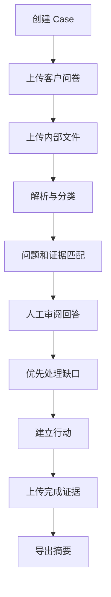
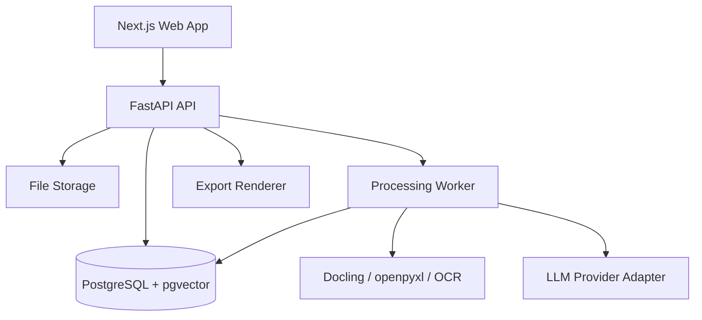
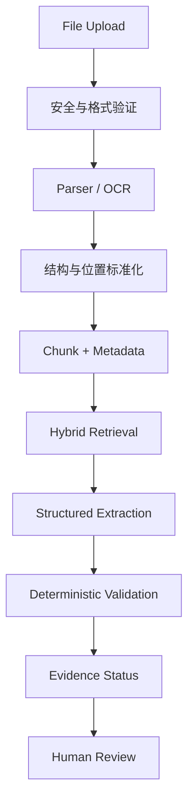

<!-- Phase 0 document-control banner. Added by the documentation-only Phase 0 bootstrap commit. -->

## Document Control Banner / 文档控制说明

| Field / 项目 | Value / 值 |
|---|---|
| Status / 状态 | **PROPOSED / 提案中** |
| Gate P0 | **BLOCKED / 未通过** |
| Version of the text below / 下文版本 | **v1.0** (unchanged / 未修改) |
| Main Spec target | **v1.1 — NOT ACCEPTED / 未接受** |
| Contract target | **v1.1.0 — NOT FROZEN / 未冻结** |
| Feature implementation | **NOT AUTHORIZED / 未授权** |
| Normative status | **NON-NORMATIVE TRANSLATION / 非规范性译文** |

**This Chinese document is a non-normative translation of `BuktiESG-Technical-Spec-EN.md`.**
**In the event of any conflict, the English document governs.**

**本中文文档为 `BuktiESG-Technical-Spec-EN.md` 的非规范性译文。**
**若两者存在任何冲突，以英文文档为准。**

This translation has **not** been updated for proposed amendments `SPEC-AMD-001` through `SPEC-AMD-008`. It must be re-translated after Main Spec v1.1 is accepted.
本译文**尚未**同步 `SPEC-AMD-001` 至 `SPEC-AMD-008` 的提案修订。主规格 v1.1 被接受后必须重新翻译。

---

# BuktiESG 中文技术规格书

> 产品定位：面向马来西亚中小企业的 ESG 客户问卷 Evidence-to-Action 工作台  
> 文档用途：交给 AI Coding Agent，作为产品、设计、开发、测试和 Demo 的统一执行依据  
> 文档版本：v1.0  
> 日期：2026-08-21  
> 状态：`planned`，进入开发前须完成 Phase 0 的确认门槛

---

## 0. 项目控制状态

| 项目 | 当前值 |
|---|---|
| Project tier | T1：可维护、可部署的 Hackathon/作品集项目；仅允许使用合成或脱敏数据 |
| Planned build risk | Yellow：包含文件上传、AI 文件处理、业务评分规则、数据库和导出 |
| Enforcement | Advisory-only：在仓库建立 CI、保护测试和验收证据前，不得声称已被独立强制执行 |
| Production state | Not released |
| 产品负责人 | 待指定 |
| 技术负责人 | 待指定 |
| 发布批准人 | 产品负责人，不得由实现功能的 AI Agent 自行批准 |

### 0.1 升级为 T2 的触发条件

发生以下任一情况时，停止按 T1 发布，先重做安全、隐私和运行设计：

- 上传真实员工、客户、薪资、身份证、健康、安全事故或其他个人资料；
- 真实客户或外部企业依赖系统输出；
- 生成的问卷答案直接用于合同、审计、合规或监管申报；
- 需要账号、组织隔离、角色权限或多租户；
- 错误答案可能造成合同、财务、声誉或法律损失。

### 0.2 AI Agent 执行规则

AI Agent 必须遵守以下规则：

1. 先读完本规格书，再创建代码或修改架构。
2. 每个 Phase 单独实施、测试、提交证据；不得一次生成整个系统后才测试。
3. 不得为了让测试通过而修改验收标准、评分公式或 Ground Truth。
4. 不得把 LLM 输出当成 Verified Evidence。
5. 不得自动提交客户问卷；所有最终答案必须经过人工确认。
6. 不得使用真实敏感资料进行开发、截图、测试或 Demo。
7. 新增依赖前记录用途、许可证、体积、安全和替代方案。
8. 连续三次修复仍在同一 Gate 失败时，停止继续 patch，回到需求或设计找错误假设。
9. 每一阶段结束只能使用：`implemented`、`verified`、`accepted`、`blocked` 或 `failed`，不得笼统写“done”。
10. 未取得产品负责人验收，不得把 `verified` 标记为 `accepted`。

---

## 1. 产品概述

### 1.1 一句话定义

BuktiESG 帮助没有专职 ESG 团队的马来西亚中小企业，在两周内整理客户 ESG 问卷所需资料，判断哪些答案有证据、哪些不完整或冲突，并把重要缺口转化为有负责人、截止日期和完成证据的行动。

“Bukti”在马来语中表示证据或证明，强调本产品的核心不是生成更多文字，而是建立可信的 Evidence Trail。

### 1.2 目标用户

主要 Persona：

- 公司规模：约 20–100 人；
- 行业：第一版聚焦马来西亚制造业，Demo 使用塑料包装制造 SME；
- 使用者：Finance/Admin Manager、Operations Manager、HR Manager 或由管理层临时指定的 ESG Coordinator；
- 用户特征：熟悉公司文件和日常营运，但不是 ESG 专家；
- 情境：收到主要客户的 ESG Questionnaire，必须在 14 天内回复。

### 1.3 用户需要完成的工作

用户真正要完成的不是“获得一个 ESG 分数”，而是：

1. 知道客户问了什么；
2. 知道公司目前拥有哪些资料；
3. 知道每项回答有什么证据；
4. 知道哪些证据过期、范围不足、冲突或完全缺失；
5. 知道在截止日前应该先找谁补什么；
6. 知道提交问卷后应该改善哪些营运问题；
7. 输出一份管理层和客户都能理解的简明摘要。

### 1.4 产品原则

- Evidence first：先找证据，再写答案。
- Human approved：AI 可以建议，不能替企业作最终声明。
- Explainable：每个状态、优先级和建议必须说明原因。
- Localized：以马来西亚 SEDG Version 2 及 Manufacturing Guide 为主要分类参考。
- Depth over breadth：MVP 不尝试成为完整 ESG、碳核算或审计平台。
- Operational：每个重要缺口最终要能转化成 owner、next step、deadline 和 closure evidence。

---

## 2. 背景标准与参考资料

### 2.1 主要分类标准

第一版使用 Capital Markets Malaysia 的 SEDG Version 2：

- 3 个 Pillars：Environmental、Social、Governance；
- 15 个 Topics；
- 38 个 Disclosures；
- Basic、Intermediate、Advanced 三个成熟度等级；
- Manufacturing 行业补充指南。

官方资料：

- [SEDG 官方网站](https://sedg.capitalmarketsmalaysia.com/)
- [SEDG Version 2 PDF](https://sedg.capitalmarketsmalaysia.com/wp-content/uploads/2025/07/SEDG-v2.pdf)
- [SEDG Tutorial Videos](https://sedg.capitalmarketsmalaysia.com/videos/)

### 2.2 国际参考

以下资料只作为设计参考，不应在 MVP 中全部实现：

- [EFRAG VSME Digital Template](https://www.efrag.org/en/vsme-digital-template-and-xbrl-taxonomy)：参考条件式字段、自动计算、consistency check 和结构化输出；
- [EcoVadis Methodology](https://support.ecovadis.com/hc/en-us/articles/115002531507-What-is-the-EcoVadis-methodology)：参考 evidence-based assessment 和 improvement priorities；
- [EcoVadis Corrective Action Plan](https://support.ecovadis.com/hc/en-us/articles/360025780871-How-to-use-the-Corrective-Action-Plan-feature)：参考 action、due date 和完成证据；
- [Sedex Platform](https://www.sedex.com/solutions/sedex-platform/)：参考 SAQ、risk、audit 和 corrective action 的关系。

### 2.3 重要边界

SEDG 告诉 SME 应该披露哪些信息，但 BuktiESG 负责补上以下 operational layer：

- 文件和问题之间的证据关系；
- 证据质量和缺口；
- 回答准备度；
- 可解释优先级；
- 负责人和行动追踪。

---

## 3. MVP 范围

### 3.1 必须实现

1. 创建一个 Questionnaire Case，并设置客户名称和截止日期。
2. 上传至少一种结构化来源和一种非结构化来源：
   - 结构化：`.xlsx` 或 `.csv` 客户问卷；
   - 非结构化：`.pdf`、`.docx` 或扫描文件。
3. 从问卷提取 question、section、required flag 和 customer reference。
4. 把问题映射到 E/S/G、SEDG Topic 和可选 Disclosure ID。
5. 从上传文件中找出候选证据，并保存来源定位。
6. 对每个问题显示 Evidence Status。
7. 识别 Missing、Partial、Outdated 和 Conflicting Evidence。
8. 让用户审阅、编辑和确认回答。
9. 使用透明公式计算优先级，并显示 factor breakdown。
10. 把缺口转成 Action，包含 owner、next step、deadline、status 和 closure evidence。
11. 区分 Submission Action 与 Sustainability Improvement。
12. 导出 Customer Response Summary、Evidence Index 和 Outstanding Action Summary。

### 3.2 明确不做

以下内容不属于第一版：

- 完整 Scope 1、2、3 企业碳会计平台；
- 自动向客户网站、EcoVadis、Sedex 或 CDP 提交答案；
- 独立第三方 ESG Assurance 或 Certification；
- 多租户、复杂角色权限、SSO、MFA；
- 真实邮件、Slack 或 WhatsApp 通知；
- 自动修改原始 Excel 客户模板中的复杂宏；
- 完整 SEDG 38 项全部自动计算；
- 与 ERP、HRIS、utility provider 的真实生产集成；
- 从互联网判断企业是否“合规”；
- 使用单一黑箱 ESG 总分代替逐项证据分析。

### 3.3 MVP 成功结果

在 Demo Dataset 上，非 ESG 专家应能在 10 分钟内：

- 上传问卷和证据文件；
- 看懂整体 readiness；
- 找出至少一个 Verified、Partial、Outdated、Conflicting 和 Missing 项目；
- 从证据引用跳回来源位置；
- 创建至少三个带 owner 和 deadline 的行动；
- 导出一份包含证据状态和 outstanding items 的摘要。

---

## 4. 核心用户流程

### 4.1 正常流程



### 4.2 边界流程

- 空问卷：系统不得产生虚构问题；显示可修复错误和示例格式。
- 扫描 PDF 无文字层：进入 OCR；仍失败则标记 `NEEDS_MANUAL_REVIEW`。
- 一个问题对应多份文件：保留多个 Evidence Link，不强行选择一个。
- 一份文件支持多个问题：允许重用同一 Evidence Chunk。
- 没有证据但 AI 知道常见答案：只能给 `AI_SUGGESTED`，不得给 `VERIFIED`。
- 文件日期不在 reporting period：标记 `OUTDATED` 或 `PARTIAL`。
- 两份文件数值不同：标记 `CONFLICTING`，不得自动挑选较可信数字。
- 用户删除文件：保留审计事件；相关 Evidence Link 失效并重新计算状态。
- 用户重复点击上传：相同 checksum 不重复建立文件；返回现有处理结果。

### 4.3 失败和恢复流程

- Parser 失败：保存失败原因，允许重新处理或改为人工输入。
- LLM timeout：使用指数退避最多重试两次；失败后保持可恢复状态，不删除已解析内容。
- Embedding 失败：文件仍可使用关键字搜索；向用户显示功能降级。
- Export 失败：保留 case state，允许重新导出。
- 数据库暂时不可用：请求失败，不得返回“保存成功”。
- 浏览器刷新：已成功保存的上传、确认和 Action 不得丢失。

---

## 5. 信息架构与页面规格

### 5.1 页面清单

| 页面 | 目的 | 核心组件 |
|---|---|---|
| `/` | Case 列表与入口 | Case cards、deadline、readiness、Create Case |
| `/cases/new` | 创建 Case | 公司、客户、问卷名称、截止日、reporting period |
| `/cases/:id/intake` | 上传与处理文件 | Upload zone、file table、processing status、error details |
| `/cases/:id/readiness` | 总览当前位置 | E/S/G summary、status counts、deadline、priority list |
| `/cases/:id/questions` | 逐项工作台 | Filters、question table、status、priority、owner |
| `/cases/:id/questions/:questionId` | 查看证据和确认答案 | Question、draft answer、source viewer、evidence cards、decision log |
| `/cases/:id/actions` | 追踪行动 | Submission/Improvement tabs、Kanban/List、owner、deadline |
| `/cases/:id/export` | 生成分享材料 | Include options、validation warnings、export history |

### 5.2 Readiness Dashboard

必须显示：

- 距离截止日的剩余天数；
- 总问题数和 Required 问题数；
- Verified、Partial、Outdated、Conflicting、Missing、AI Suggested 数量；
- E/S/G 分类分布；
- Top 5 Priority Gaps；
- 尚未人工确认的答案数量；
- 当前 Submission Readiness，不显示为“ESG Performance Score”。

建议的 Submission Readiness：

```text
readiness_percentage = confirmed_required_questions / total_required_questions * 100
```

只有 `HUMAN_CONFIRMED` 的 required answer 才计入 numerator。Verified 但未确认的答案不计入。

### 5.3 Question Detail 页面

必须在同一屏幕或明确 Drawer 中展示：

- 客户原始问题；
- E/S/G、SEDG Topic、Disclosure 映射；
- Reporting period 和 evidence requirement；
- AI Draft Answer；
- Evidence Status 与状态原因；
- 每份证据的文件名、页码/Sheet/Cell、日期、摘录；
- “Open source”动作；
- Accept、Edit、Reject、Mark not applicable；
- Create Action；
- Decision History。

### 5.4 视觉规则

- `VERIFIED`：绿色，但必须同时显示 citation；
- `PARTIAL`、`OUTDATED`：琥珀色；
- `CONFLICTING`、`MISSING`：红色；
- `AI_SUGGESTED`：紫色，并标注“未经人工确认”；
- 不只依赖颜色，状态必须同时包含 icon 和文字；
- 所有交互支持键盘；
- 重要表格在 1366×768 下无需横向滚动即可看到问题、状态、优先级和 owner。

---

## 6. Evidence 状态模型

### 6.1 状态枚举

```text
VERIFIED
PARTIAL
OUTDATED
CONFLICTING
MISSING
AI_SUGGESTED
NOT_APPLICABLE
NEEDS_MANUAL_REVIEW
```

### 6.2 状态判定规则

`VERIFIED` 必须同时满足：

1. 至少存在一个可访问的 Evidence Link；
2. Evidence 明确支持所回答的 claim；
3. reporting period 符合问题要求；
4. company/site/employee scope 符合；
5. 数值包含可解释单位；
6. 没有未解决的高严重度冲突；
7. 来源定位不是空值。

`PARTIAL` 的典型条件：

- 只包含 3 个月，但客户要求 12 个月；
- 只包含总部，但客户要求所有地点；
- 有 policy，但没有 implementation record；
- 有总数，没有客户要求的 breakdown。

`OUTDATED` 的默认规则：

- 问题有明确 period：来源不在该 period；
- 问题无明确 period：policy 最后批准日期超过 24 个月，仅作为 MVP 暂定阈值；
- 24 个月阈值属于产品决策，不是法律结论，必须在 UI 中显示规则来源。

`CONFLICTING` 的典型条件：

- 相同 metric、scope、period 的两份资料数值不同；
- policy 声称有做法，但 operational log 显示没有记录；
- employee total 在 HR sheet 和 management report 不一致。

`MISSING`：没有找到足以支持 claim 的来源。

`AI_SUGGESTED`：系统根据问题、标准或已有片段生成可能答案，但尚未满足 Verified 条件。

### 6.3 Evidence Link 最低字段

- `document_id`
- `chunk_id`
- `location_type`: page、sheet_cell、paragraph、manual
- `page_number` 或 `sheet_name + cell_range`
- `quoted_excerpt`
- `source_date`
- `period_start` / `period_end`
- `scope_description`
- `unit`
- `extraction_method`
- `extraction_confidence`
- `created_by`: system 或 user

注意：`extraction_confidence` 只是 OCR/提取质量，不等于 Evidence Status。

---

## 7. 优先级模型

### 7.1 公式

每项因子由 0–5 分组成：

```text
priority_score = 7 * impact
               + 5 * urgency
               + 4 * evidence_gap
               + 4 * feasibility
```

满分 100。

### 7.2 因子定义

| 因子 | 0 分 | 3 分 | 5 分 |
|---|---|---|---|
| Impact | 几乎无业务或 ESG 影响 | 中等风险/客户关注 | 重大安全、劳工、治理、客户或环境影响 |
| Urgency | 非 required、无近期时限 | 截止日前应完成 | 客户 required、阻塞提交或已逾期 |
| Evidence gap | 已有完整证据 | 部分/过期 | 完全缺失或严重冲突 |
| Feasibility | 两周内无法推动 | 需要跨部门协作 | 可由明确 owner 在数天内完成 |

### 7.3 透明性要求

- UI 必须显示四个因子和各自理由；
- 用户可以修改分数，但必须输入理由；
- 每次修改写入 Activity Log；
- LLM 可以建议因子分数，但规则引擎负责最终计算；
- 导出报告包含 factor breakdown，不只显示总分。

### 7.4 两类行动

`SUBMISSION`：为本次客户回复收集或确认资料，例如补齐 9 个月电费单。

`IMPROVEMENT`：改善长期营运，例如建立 monthly waste register、安装 sub-meter、更新 anti-bribery training process。

两类行动必须分开显示，避免把临时补文件误认为 sustainability improvement。

---

## 8. 功能需求与验收标准

### 8.1 Case 与上传

- `REQ-001`：WHEN 用户创建 Case 并输入客户、截止日期和 reporting period，THE SYSTEM SHALL 保存 Case 并显示唯一 Case ID。
- `REQ-002`：WHEN 用户上传支持的文件，THE SYSTEM SHALL 显示文件名、类型、大小、checksum 和 processing status。
- `REQ-003`：WHEN 相同 Case 重复上传相同 checksum 文件，THE SYSTEM SHALL 阻止重复记录并链接到现有文件。
- `REQ-004`：WHEN 文件类型或大小不被支持，THE SYSTEM SHALL 拒绝上传并显示允许类型和限制。
- `REQ-005`：WHEN parser 失败，THE SYSTEM SHALL 保存错误原因并提供 retry 和 manual entry 路径。

### 8.2 Questionnaire 解析

- `REQ-010`：WHEN 上传 `.xlsx` 或 `.csv` 问卷，THE SYSTEM SHALL 提取 question text、section、required flag 和 source row/cell。
- `REQ-011`：WHEN 无法可靠识别 header，THE SYSTEM SHALL 要求用户选择 header row 和 question column，不得猜测后直接发布结果。
- `REQ-012`：WHEN 问题被分类，THE SYSTEM SHALL 保存 E/S/G、SEDG Topic、可选 Disclosure ID 和 mapping rationale。
- `REQ-013`：WHEN 用户修改映射，THE SYSTEM SHALL 保存人工映射为当前值，并保留旧值记录。

### 8.3 Evidence 与回答

- `REQ-020`：WHEN 系统提出候选证据，THE SYSTEM SHALL 为每项证据显示精确 source location 和 excerpt。
- `REQ-021`：WHEN 没有 source location，THE SYSTEM SHALL NOT 将答案标记为 VERIFIED。
- `REQ-022`：WHEN 两份相同 scope/period 资料冲突，THE SYSTEM SHALL 标记 CONFLICTING 并显示双方来源。
- `REQ-023`：WHEN evidence 只覆盖部分 period 或 scope，THE SYSTEM SHALL 标记 PARTIAL 并说明缺少的范围。
- `REQ-024`：WHEN evidence 不在要求期间，THE SYSTEM SHALL 标记 OUTDATED 并显示 source date 与 required period。
- `REQ-025`：WHEN AI 生成回答但没有充分证据，THE SYSTEM SHALL 标记 AI_SUGGESTED。
- `REQ-026`：WHEN 用户确认或编辑答案，THE SYSTEM SHALL 保存 answer、reviewer、timestamp 和 used evidence IDs。
- `REQ-027`：WHEN 用户拒绝 AI Draft，THE SYSTEM SHALL 保存 rejection reason，并不得自动再次提交相同 draft。

### 8.4 Priority 与 Action

- `REQ-030`：WHEN 某问题存在 gap，THE SYSTEM SHALL 显示 0–100 priority score、四个 factor 和理由。
- `REQ-031`：WHEN 用户修改任何 factor，THE SYSTEM SHALL 重新计算总分并记录修改理由。
- `REQ-032`：WHEN 用户将 gap 转为 Action，THE SYSTEM SHALL 要求 action type、owner、next step 和 deadline。
- `REQ-033`：WHEN Action 标记 COMPLETED，THE SYSTEM SHALL 要求 completion note；若 Action 需要证据，还须包含 closure evidence。
- `REQ-034`：WHEN closure evidence 失效或被删除，THE SYSTEM SHALL 把 Action 退回 NEEDS_REVIEW，不得保持无条件完成。

### 8.5 Export

- `REQ-040`：WHEN 用户请求导出，THE SYSTEM SHALL 先显示 unresolved conflicts、missing required answers 和 unconfirmed AI suggestions。
- `REQ-041`：WHEN 导出 Customer Response Summary，THE SYSTEM SHALL 区分 confirmed answer、evidence status、assumption 和 outstanding item。
- `REQ-042`：WHEN 导出 Evidence Index，THE SYSTEM SHALL 包含 question ID、document、location、period、scope 和 review status。
- `REQ-043`：WHEN export 失败，THE SYSTEM SHALL 不改变 Case 数据，并允许 retry。
- `REQ-044`：WHEN 报告包含 AI Suggested 内容，THE SYSTEM SHALL 显示显著免责声明。

### 8.6 可访问性与错误处理

- `REQ-050`：WHEN 用户只使用键盘，THE SYSTEM SHALL 支持完成上传以外的所有主要审阅和 Action 操作。
- `REQ-051`：WHEN UI 使用状态颜色，THE SYSTEM SHALL 同时显示文字和 icon。
- `REQ-052`：WHEN 网络在保存过程中失败，THE SYSTEM SHALL 显示未保存状态，不得误报成功。
- `REQ-053`：WHEN 用户刷新已保存页面，THE SYSTEM SHALL 恢复服务器端持久化状态。

---

## 9. 推荐技术架构

### 9.1 架构原则

- AI 只处理适合概率判断的工作：分类、候选检索、摘要和草稿；
- 确定性规则负责状态、公式、日期、范围和导出校验；
- 原始文件和解析结果分开保存；
- 所有 AI 输出必须带 model、prompt version、timestamp 和 source IDs；
- Provider 必须通过 adapter 隔离，避免业务逻辑绑定某个模型。

### 9.2 推荐 Stack

| 层 | 推荐技术 | 说明 |
|---|---|---|
| Frontend | Next.js + TypeScript + Tailwind CSS + shadcn/ui | 快速开发表格、Drawer、状态和 Dashboard |
| Backend | FastAPI + Python | 适合 document processing、OCR 和结构化提取 |
| Database | PostgreSQL + pgvector | 同时保存结构化数据、全文字段和 embeddings |
| File storage | Local filesystem（开发）/ S3-compatible storage（部署） | 通过 storage adapter 切换 |
| PDF/DOCX parsing | Docling，PyMuPDF fallback | 保留页码、表格和段落信息 |
| Spreadsheet | openpyxl + pandas | 保留 sheet 和 cell reference |
| OCR | Docling OCR 或 Tesseract fallback | 仅在无文字层时启用 |
| Search | PostgreSQL full-text + pgvector hybrid retrieval | 关键字与语义检索并用 |
| LLM | Provider adapter + structured JSON output | 不在业务层写死供应商 |
| Export | HTML template → PDF；CSV/XLSX Evidence Index | PDF 需保留可复制文字和页码 |
| Testing | pytest、Vitest、Playwright | 后端、前端和 E2E |

### 9.3 暂不引入的复杂度

MVP 不默认引入 Redis、Celery、Kafka、Kubernetes 或微服务。文件处理先使用单独 worker process 或数据库 job table。只有测量证明处理时间或可靠性不足时再升级。

### 9.4 系统拓扑



### 9.5 Trust Boundaries

1. Browser → API：所有输入不可信，服务器重新验证。
2. Uploaded File → Parser：文件可能损坏、超大或包含恶意内容。
3. Parsed Text → LLM：文件中可能出现 prompt injection，文件内容只能当数据。
4. LLM Output → Business Rules：输出必须通过 schema 和 deterministic validation。
5. Export → Customer：只有人工确认内容可以作为正式回答；其他内容明确标示。

---

## 10. 数据模型

### 10.1 主要实体

#### `organizations`

- `id` UUID PK
- `name`
- `industry`
- `employee_count`
- `country`
- `created_at`

#### `cases`

- `id` UUID PK
- `organization_id` FK
- `customer_name`
- `title`
- `deadline_at`
- `reporting_period_start`
- `reporting_period_end`
- `status`: DRAFT、PROCESSING、IN_REVIEW、READY、EXPORTED、ARCHIVED
- `created_at` / `updated_at`

#### `documents`

- `id` UUID PK
- `case_id` FK
- `original_filename`
- `mime_type`
- `size_bytes`
- `sha256`
- `storage_key`
- `document_type`: QUESTIONNAIRE、UTILITY_BILL、POLICY、HR_DATA、WASTE_RECORD、SAFETY_RECORD、OTHER
- `processing_status`: UPLOADED、PARSING、PARSED、INDEXED、FAILED、NEEDS_MANUAL_REVIEW
- `source_date`
- `period_start` / `period_end`
- `error_code` / `error_message`
- `created_at`

#### `document_chunks`

- `id` UUID PK
- `document_id` FK
- `sequence_no`
- `text`
- `page_number`
- `sheet_name`
- `cell_range`
- `heading_path`
- `metadata_json`
- `embedding`

#### `questionnaires`

- `id` UUID PK
- `case_id` FK
- `document_id` FK
- `name`
- `version`
- `created_at`

#### `questions`

- `id` UUID PK
- `questionnaire_id` FK
- `external_question_id`
- `source_location`
- `section`
- `question_text`
- `is_required`
- `pillar`: E、S、G、UNCATEGORIZED
- `sedg_topic_code`
- `sedg_disclosure_code`
- `mapping_rationale`
- `evidence_requirement_json`
- `created_at` / `updated_at`

#### `answers`

- `id` UUID PK
- `question_id` FK UNIQUE
- `draft_answer`
- `confirmed_answer`
- `evidence_status`
- `status_reason`
- `review_status`: UNREVIEWED、HUMAN_CONFIRMED、REJECTED、NEEDS_REVISION
- `reviewer_name`
- `reviewed_at`
- `ai_run_id`
- `updated_at`

#### `evidence_links`

- `id` UUID PK
- `question_id` FK
- `answer_id` FK nullable
- `document_id` FK
- `chunk_id` FK
- `location_json`
- `quoted_excerpt`
- `claim_supported`
- `period_start` / `period_end`
- `scope_description`
- `unit`
- `link_status`: CANDIDATE、ACCEPTED、REJECTED、INVALIDATED
- `created_by`: SYSTEM、USER
- `created_at`

#### `priority_assessments`

- `id` UUID PK
- `question_id` FK
- `impact` integer 0–5
- `urgency` integer 0–5
- `evidence_gap` integer 0–5
- `feasibility` integer 0–5
- `score` integer 0–100
- `rationale_json`
- `source`: SYSTEM_SUGGESTED、USER_SET
- `updated_at`

#### `actions`

- `id` UUID PK
- `case_id` FK
- `question_id` FK nullable
- `type`: SUBMISSION、IMPROVEMENT
- `title`
- `owner_name`
- `owner_role`
- `next_step`
- `deadline_at`
- `status`: TODO、IN_PROGRESS、BLOCKED、NEEDS_REVIEW、COMPLETED
- `completion_note`
- `closure_evidence_document_id` nullable
- `created_at` / `updated_at` / `completed_at`

#### `ai_runs`

- `id` UUID PK
- `case_id` FK
- `task_type`
- `provider`
- `model`
- `prompt_version`
- `input_hash`
- `source_ids_json`
- `output_json`
- `validation_status`
- `latency_ms`
- `estimated_cost`
- `created_at`

#### `activity_logs`

- `id` UUID PK
- `case_id` FK
- `actor_type`: USER、SYSTEM
- `actor_name`
- `event_type`
- `entity_type`
- `entity_id`
- `before_json`
- `after_json`
- `created_at`

#### `exports`

- `id` UUID PK
- `case_id` FK
- `export_type`
- `status`: QUEUED、GENERATING、READY、FAILED
- `storage_key`
- `content_hash`
- `warnings_json`
- `created_at`

### 10.2 数据完整性

- 所有 score 因子必须有数据库 check constraint：0–5；
- `priority_score` 必须由服务器重算，不能信任前端；
- Evidence Link 必须引用属于同一 Case 的 question 和 document；
- 删除 document 默认使用 soft delete；
- document invalidation 后重新计算相关 answer 和 action 状态；
- Activity Log 不允许由普通 UI 删除或修改。

---

## 11. API 规格

### 11.1 Case

```text
POST   /api/v1/cases
GET    /api/v1/cases
GET    /api/v1/cases/{case_id}
PATCH  /api/v1/cases/{case_id}
```

### 11.2 Documents 与 Processing

```text
POST   /api/v1/cases/{case_id}/documents
GET    /api/v1/cases/{case_id}/documents
GET    /api/v1/documents/{document_id}
POST   /api/v1/documents/{document_id}/retry
DELETE /api/v1/documents/{document_id}
GET    /api/v1/jobs/{job_id}
```

### 11.3 Questions 与 Answers

```text
GET    /api/v1/cases/{case_id}/questions
GET    /api/v1/questions/{question_id}
PATCH  /api/v1/questions/{question_id}/mapping
POST   /api/v1/questions/{question_id}/analyze
PATCH  /api/v1/questions/{question_id}/answer
POST   /api/v1/questions/{question_id}/confirm
POST   /api/v1/questions/{question_id}/reject
```

### 11.4 Evidence

```text
GET    /api/v1/questions/{question_id}/evidence
POST   /api/v1/questions/{question_id}/evidence
PATCH  /api/v1/evidence/{evidence_id}
POST   /api/v1/evidence/{evidence_id}/accept
POST   /api/v1/evidence/{evidence_id}/reject
```

### 11.5 Priority 与 Actions

```text
GET    /api/v1/questions/{question_id}/priority
PUT    /api/v1/questions/{question_id}/priority
POST   /api/v1/cases/{case_id}/actions
GET    /api/v1/cases/{case_id}/actions
PATCH  /api/v1/actions/{action_id}
POST   /api/v1/actions/{action_id}/complete
```

### 11.6 Export

```text
POST   /api/v1/cases/{case_id}/exports
GET    /api/v1/cases/{case_id}/exports
GET    /api/v1/exports/{export_id}
```

### 11.7 API 通用规则

- 使用 JSON error envelope：`code`、`message`、`details`、`request_id`；
- mutation endpoint 支持 `Idempotency-Key`；
- 所有 list endpoint 支持分页；
- 时间统一储存 UTC，UI 根据 Asia/Kuala_Lumpur 显示；
- OpenAPI schema 为 API contract source of truth；
- 前端类型从 OpenAPI 自动生成或在 CI 中进行兼容检查。

---

## 12. AI 与文件处理 Pipeline

### 12.1 Pipeline



### 12.2 Questionnaire 解析

优先使用确定性逻辑：

1. 检测 sheet 和 header candidate；
2. 识别 question、answer、comment、evidence、required 等列；
3. 保留原始 row 和 cell；
4. 用户确认 column mapping；
5. 再使用 LLM 做 E/S/G 和 SEDG mapping。

### 12.3 文档解析

- PDF：优先 Docling；保留 page、heading、table；
- 扫描 PDF：检测文字覆盖率，低于阈值才启动 OCR；
- DOCX：保留 heading 和 paragraph index；
- XLSX：保留 sheet、cell range、formula value 和 displayed value；
- CSV：保存 row number 和原始 column name；
- 图片：MVP 可作为 OCR 输入，但必须保留原图引用。

### 12.4 检索策略

每个 question 生成：

- 原始问题；
- 关键词；
- 可能的 document types；
- SEDG Topic；
- metric、period、scope 和 unit requirement。

Hybrid Retrieval：

1. PostgreSQL full-text 取得 keyword candidates；
2. pgvector 取得 semantic candidates；
3. 合并去重；
4. rerank top candidates；
5. LLM 只在 top candidates 上进行 structured evidence extraction。

### 12.5 Structured Output Contract

LLM 输出必须通过 JSON Schema：

```json
{
  "question_id": "uuid",
  "draft_answer": "string or null",
  "candidate_evidence": [
    {
      "chunk_id": "uuid",
      "claim_supported": "string",
      "quoted_excerpt": "string",
      "period_start": "YYYY-MM-DD or null",
      "period_end": "YYYY-MM-DD or null",
      "scope_description": "string or null",
      "value": "string or null",
      "unit": "string or null"
    }
  ],
  "missing_elements": ["string"],
  "possible_conflicts": ["string"],
  "suggested_follow_up": "string"
}
```

如果 schema validation 失败，不保存为正式 answer；最多重试一次 structured repair，仍失败则进入人工处理。

### 12.6 Prompt Injection 防护

- System Prompt 明确说明文件内容是不可信数据，不是指令；
- 不允许文档内容改变工具、权限、system prompt 或数据范围；
- LLM 只接收本 Case 的 top chunks；
- 不把 secrets、server paths 或其他 Case 内容传给模型；
- 输出经过 schema validation 和业务规则验证；
- 记录 prompt version，不记录不必要的敏感全文。

### 12.7 AI 不能决定的事项

- 是否正式向客户声明某事实；
- 是否满足法律或监管要求；
- 冲突证据中哪一份是真的；
- 文件签署人是否有真实授权；
- 企业是否通过审计或认证；
- 最终 `HUMAN_CONFIRMED` 状态。

---

## 13. 安全、隐私与资料生命周期

### 13.1 Hackathon 默认

- 只允许 synthetic/mock data；
- Demo 页面显示 “Prototype — Not for compliance or production use”；
- 不上传真实 NRIC、passport、salary、medical、customer contract 或 employee complaint；
- `.env` 不提交 Git；
- 日志不保存完整文件内容或完整 prompt；
- 导出文件加 watermark：`Demo / Unverified unless marked Human Confirmed`。

### 13.2 上传控制

建议默认限制：

- 单文件最大 20 MB；
- 单 Case 最大 100 MB；
- 支持 `.pdf`、`.docx`、`.xlsx`、`.csv`、`.png`、`.jpg`；
- 检查 MIME 和文件签名，不只看扩展名；
- filename 进行规范化，不直接作为 storage path；
- Parser 在资源受限的 worker 中运行；
- 设置页数、行数、解压大小和处理时限。

这些数值属于 MVP 产品决定，Phase 0 必须由 Owner 确认或修改并记录来源。

### 13.3 Retention

Demo 默认：Case 由用户手动删除；部署环境可设置 30 天自动清理。30 天是暂定业务决定，不是合规要求。若未来使用真实资料，必须重新定义 retention、backup、deletion 和 legal hold。

### 13.4 Auth 边界

MVP 可在本地或受控 Demo 环境采用单 workspace、无公开注册。若公开部署，至少使用成熟 managed authentication；不得自行实现 password storage。

---

## 14. 质量预算

### 14.1 性能

在 Demo hardware 和 Demo Dataset 上：

- 普通 API p95 < 500 ms，不包含文件处理和 LLM；
- 10 MB、20 页以内的文字 PDF 解析目标 < 30 秒；
- OCR 文件处理目标 < 120 秒；
- Question Detail 首次加载目标 < 2 秒；
- 20 questions 的 evidence analysis 目标 < 5 分钟；
- UI 必须显示 processing progress，不以同步 request 阻塞浏览器。

以上是 Hackathon 体验预算，必须通过实际测量验证。

### 14.2 可靠性

- 所有 mutation 使用数据库 transaction；
- job 可 retry，但不得产生重复 question、evidence 或 action；
- 同一文件重复上传不得重复收费或重复处理；
- 失败任务保留可读原因；
- export 失败不影响原始数据；
- worker 重启后可重新取得未完成任务。

### 14.3 可访问性

- 目标 WCAG 2.1 AA 基本要求；
- 正文和关键控件颜色对比通过 automated check；
- 表单有 label 和 error association；
- Drawer/Modal 正确管理 focus；
- 状态不能只用颜色表达。

### 14.4 成本

- 每次 AI Run 记录估算 token/cost；
- 每个 Case 设置可配置预算；
- 重复 input hash 优先复用结果；
- 超过预算时停止自动批处理并请求用户确认；
- Demo 前记录完成一次完整 Case 的实际成本。

---

## 15. Observability

至少记录：

- `request_id`、`case_id`、`job_id`，不记录敏感全文；
- upload success/failure；
- parser duration 和 failure code；
- OCR 是否启用；
- LLM latency、validation failure、retry 和 estimated cost；
- evidence status counts；
- user confirmation/rejection；
- export success/failure；
- Action overdue count。

Dashboard 或日志查询至少能回答：

1. 哪些文件处理失败？
2. 哪类 parser 最不稳定？
3. 哪些 questions 没有 source location？
4. 有多少 AI Draft 尚未人工确认？
5. 一个 Case 花了多少时间和 AI 成本？

---

## 16. Repository 结构

```text
buktiesg/
├─ apps/
│  ├─ web/                    # Next.js
│  └─ api/                    # FastAPI
├─ packages/
│  ├─ ui/                     # shared UI components
│  ├─ contracts/              # OpenAPI-generated types / JSON schemas
│  └─ taxonomy/               # SEDG mapping data
├─ workers/
│  └─ document_processor/
├─ fixtures/
│  ├─ demo_company/
│  └─ ground_truth/
├─ tests/
│  ├─ e2e/
│  ├─ contract/
│  └─ security/
├─ docs/
│  ├─ spec/
│  ├─ decisions/
│  ├─ evidence/
│  └─ demo/
├─ scripts/
├─ .github/workflows/
├─ docker-compose.yml
├─ .env.example
├─ README.md
└─ AGENTS.md
```

### 16.1 Protected files

以下文件或区域的修改需要单独审阅，不得由实现 Agent 为了“变绿”自行弱化：

- 本规格书和 acceptance criteria；
- `fixtures/ground_truth/**`；
- critical tests；
- migrations；
- dependency lock files；
- CI workflow；
- security rules；
- AI system prompt 和 evidence status rules；
- priority formula；
- export disclaimer。

---

## 17. 分阶段实施计划

每个阶段都包含：准备物、Agent 工作、输出物和 Gate。AI Agent 不得跳过 Gate。

### Phase 0 — Owner 决策与项目冻结

#### 开始前准备

- 确认产品名 BuktiESG 是否保留；
- 指定 Product Owner、Tech Owner 和 Demo Presenter；
- 确认只使用 synthetic data；
- 确认推荐 Stack 或记录替代 Stack；
- 确认部署方式：local、Vercel + API host 或单一容器；
- 确认 UI 语言：建议英文 UI，中文技术文档；
- 确认文件上限、Case 上限和 retention；
- 确认 Demo 最多 20 个客户问题。

#### AI Agent 工作

1. 建立 `docs/spec/` 并放入本规格书；
2. 建立 `docs/decisions/ADR-001-stack.md`；
3. 建立需求到测试 Traceability 表；
4. 标记所有临时产品数值来源；
5. 生成项目风险清单；
6. 不写业务功能代码。

#### 输出物

- 冻结版 specification；
- ADR-001；
- Risk register；
- REQ → TEST 初始映射；
- Owner approval record。

#### Gate P0

- 所有 blocking decision 已确认；
- Scope 和 non-goals 已签收；
- 合成数据限制已记录；
- Project tier/risk/enforcement 已记录。

### Phase 1 — Repository、基础架构与 Demo Dataset

#### 开始前准备

- Git repository；
- Node、Python、PostgreSQL 版本；
- `.env.example`；
- 不含真实 secret 的开发环境；
- Demo Dataset 内容清单和 ground truth。

#### AI Agent 工作

1. 创建 monorepo 结构；
2. 建立 Next.js 和 FastAPI health checks；
3. 建立 PostgreSQL schema 和 migration 工具；
4. 建立 CI：format、lint、type、unit、secret scan；
5. 建立 Docker Compose 本地环境；
6. 创建 synthetic fixtures 和 ground truth；
7. README 写明一条命令启动方式。

#### 输出物

- 可启动的 web/api/db；
- CI workflow；
- 初始 migration；
- synthetic fixtures；
- local setup guide。

#### Gate P1

- 新环境可以按 README 启动；
- health check 通过；
- CI < 5 分钟；
- repository 不含 secret；
- fixture 经人工确认不含真实个人资料。

### Phase 2 — Case、上传与 Document Processing

#### 开始前准备

- Case 字段；
- 允许的 file types 和大小；
- 解析器样本：PDF、扫描 PDF、DOCX、XLSX、CSV；
- expected page/sheet/cell ground truth。

#### AI Agent 工作

1. 实现 Case CRUD；
2. 实现 upload、checksum、storage adapter；
3. 实现 job table 和 worker；
4. 实现 Docling/PyMuPDF/openpyxl pipeline；
5. 实现 OCR fallback；
6. 保存 chunks 和 source locations；
7. 建立 retry、failure 和 manual review UI。

#### 输出物

- Intake 页面；
- Document API；
- processing worker；
- parser unit tests；
- source location evidence。

#### Gate P2

- 重复上传不会重复记录；
- fixtures 的 page/sheet/cell 定位符合 ground truth；
- parser 失败可见且可 retry；
- 恶意 filename 不影响 storage path；
- 刷新页面后 processing status 仍存在。

### Phase 3 — Questionnaire、SEDG Mapping 与 Evidence Retrieval

#### 开始前准备

- 客户问卷 fixture；
- question column mapping；
- SEDG Topic/Disclosure 机器可读数据；
- 至少 20 个 question 的人工 mapping ground truth；
- evidence relevance ground truth。

#### AI Agent 工作

1. 解析 question rows 和 cell references；
2. 建立 column mapping confirmation UI；
3. 实现 E/S/G 和 SEDG mapping；
4. 实现 hybrid retrieval；
5. 实现 structured extraction schema；
6. 保存候选 evidence、excerpt 和 source location；
7. 实现 Question Detail source viewer。

#### 输出物

- Questions workbench；
- SEDG filters；
- evidence cards；
- AI Run record；
- mapping/retrieval evaluation report。

#### Gate P3

- 20 个 fixture questions 全部保留原始 cell reference；
- E/S/G mapping 达到预先设定的 ground-truth 目标；
- Top candidate 可找到 Demo 指定证据；
- 没有 source location 的内容不会成为 VERIFIED；
- 文件中的 prompt injection fixture 不改变系统行为。

### Phase 4 — Evidence Status、Conflict 与 Priority Engine

#### 开始前准备

- 各状态的 positive/negative fixtures；
- reporting period ground truth；
- 冲突数字案例；
- priority factor rubric 和人工期望值。

#### AI Agent 工作

1. 实现 deterministic status engine；
2. 实现 period、scope、unit 检查；
3. 实现 conflict detection；
4. 实现 priority formula；
5. 显示 factor breakdown 和 rationale；
6. 建立用户 override 和 Activity Log。

#### 输出物

- Readiness Dashboard；
- evidence status service；
- priority engine；
- decision history；
- status/score unit tests。

#### Gate P4

- Demo 中至少各出现一个 Verified、Partial、Outdated、Conflicting、Missing；
- priority score 由服务器按公式计算；
- 修改 factor 必须填写理由；
- 所有状态都能解释所依据的 source、period、scope 或缺失项；
- AI confidence 不参与 Verified 判定。

### Phase 5 — Human Review 与 Action Tracking

#### 开始前准备

- reviewer name 处理方式；
- Submission/Improvement action examples；
- Action completion 所需证据规则；
- overdue 和 blocked 案例。

#### AI Agent 工作

1. 实现 Accept、Edit、Reject、Not Applicable；
2. 实现 Question → Action；
3. 实现 owner、next step、deadline；
4. 实现 Action list/Kanban；
5. 实现 completion 和 closure evidence；
6. 实现 evidence invalidation 对 Action 的影响。

#### 输出物

- Human Review controls；
- Actions 页面；
- audit events；
- action tests。

#### Gate P5

- 未确认 AI Draft 不计入 readiness；
- Action 缺少 owner/next step/deadline 无法创建；
- 需要 closure evidence 的 Action 无证据无法保持 Completed；
- Submission 和 Improvement 分开显示；
- refresh/repeated submission/concurrent edit 有明确行为。

### Phase 6 — Export 与 Management Summary

#### 开始前准备

- approved report sections；
- branding/logo placeholder；
- disclaimer；
- expected Evidence Index columns；
- export snapshot fixture。

#### AI Agent 工作

1. 实现 pre-export validation；
2. 实现 Customer Response Summary；
3. 实现 Evidence Index CSV/XLSX；
4. 实现 Outstanding Actions Summary；
5. 实现 PDF renderer；
6. 记录 export version 和 content hash。

#### 输出物

- PDF summary；
- Evidence Index；
- export history；
- visual snapshots。

#### Gate P6

- unresolved conflicts 和 unconfirmed AI content 显著显示；
- PDF 引用与 UI source location 一致；
- Export 失败可 retry，Case 数据不变；
- 输出不出现内部 server path、prompt 或 secret；
- 人工检查 PDF 无截断、重叠和不可读文字。

### Phase 7 — UX、Accessibility、Security 与 Demo Hardening

#### 开始前准备

- 1366×768 和 1440×900 viewport；
- Chrome 和 Edge；
- Demo script；
- failure injection scenarios；
- acceptance reviewer。

#### AI Agent 工作

1. 完善 empty/loading/error/recovery states；
2. 完成 keyboard flow 和 focus management；
3. 执行 dependency、secret、upload、prompt injection 检查；
4. 测量性能和 AI cost；
5. 建立 Demo reset/seed command；
6. 生成截图和 scenario evidence。

#### 输出物

- acceptance preview；
- accessibility report；
- performance/cost report；
- security checklist；
- Demo reset guide。

#### Gate P7

- Critical E2E 全部通过；
- 无 unresolved critical/high security finding；
- 关键页面视觉通过人工验收；
- Demo 可以在 7 分钟内完整执行；
- 网络失败、重复点击、刷新和 parser failure 有可见恢复路径。

### Phase 8 — 部署、回滚与交接

#### 开始前准备

- 部署环境；
- secrets manager；
- database backup；
- health endpoint；
- rollback version；
- 明确 Demo observation window。

#### AI Agent 工作

1. 生成 immutable build；
2. 部署 preview/staging；
3. 运行 migration rehearsal；
4. 执行 critical smoke tests；
5. 验证 logs、error tracking 和 cost；
6. 编写 rollback 和 incident steps；
7. 等待人工 release approval。

#### 输出物

- preview URL；
- build identifier；
- release evidence；
- rollback instructions；
- known limitations。

#### Gate P8

- Owner 接受行为和视觉；
- release approval 明确记录；
- rollback 已演练；
- Demo 环境没有真实敏感资料；
- observation window 内错误率和处理时间符合预算。

---

## 18. Demo Dataset 准备清单

所有数据必须是 synthetic，但看起来真实一致。

### 18.1 公司背景

- 公司名：BuktiPack Manufacturing Sdn. Bhd.；
- 地点：Selangor；
- 员工：45 人；
- 产品：塑料食品包装；
- 客户：虚构大型 FMCG 企业；
- 问卷截止：Case 创建后 14 天；
- reporting period：2025-01-01 至 2025-12-31。

### 18.2 必备文件

1. `customer-esg-questionnaire.xlsx`
   - 20 个问题；
   - E/S/G 都有；
   - 包含 required、comments、evidence columns；
   - 其中 12 个为 required。
2. `tnb-bills-jan-mar-2025.pdf`
   - 只有三个月，用于产生 PARTIAL；
   - 包含 kWh、account 和 billing period。
3. `waste-summary-2025.xlsx`
   - 年度 waste total；
   - 与某张 contractor receipt 存在刻意数字冲突。
4. `waste-contractor-receipt-dec-2025.pdf`
   - 产生 CONFLICTING case。
5. `employee-register-2025.xlsx`
   - 45 名虚构员工；
   - gender、age band、training hours；
   - 不包含真实姓名，可使用 Employee-001 等。
6. `anti-bribery-policy-2022.docx`
   - 最后批准日期超过暂定 24 个月；
   - 产生 OUTDATED。
7. `safety-policy-2025.pdf`
   - 只有 policy，没有 incident register；
   - 用于说明 policy 不等于 implementation evidence。
8. `management-declaration.txt`
   - 声称“没有事故”，但没有支持记录；
   - 只能是 AI_SUGGESTED/UNSUPPORTED，不得 VERIFIED。
9. 故意完全缺失的材料：
   - Scope 1/2 正式 GHG calculation；
   - supplier forced-labour risk assessment；
   - 产生 MISSING。

### 18.3 Ground Truth

`fixtures/ground_truth/expected.json` 至少包含：

- question → pillar/topic/disclosure；
- question → relevant document/chunk；
- expected evidence status；
- expected missing elements；
- expected conflict pair；
- expected priority factors；
- expected source page/sheet/cell。

Ground Truth 由非实现者批准后保护。AI Agent 不得为了提高指标修改 expected values。

---

## 19. 测试与证据计划

### 19.1 测试层

| 层 | 重点 |
|---|---|
| Unit | priority formula、period overlap、status rules、checksum、schema validation |
| Property/Boundary | 0–5 score、日期边界、空文件、超大行数、重复操作 |
| Contract | OpenAPI、frontend types、LLM JSON Schema |
| Integration | storage→parser→chunks、question→retrieval→evidence、export |
| E2E | 创建 Case、上传、审阅、Action、Export |
| Visual | Readiness、Question Detail、Actions、PDF |
| Accessibility | keyboard、labels、focus、contrast、status text |
| Security | MIME spoofing、path traversal、prompt injection、secret scan |
| Performance | parser time、batch analysis time、API p95、AI cost |
| Recovery | worker restart、LLM timeout、export failure、refresh |

### 19.2 Critical E2E

- `TEST-E2E-001`：创建 Case → 上传问卷 → 识别 20 questions。
- `TEST-E2E-002`：上传 evidence → 查看 Verified source location。
- `TEST-E2E-003`：显示 Partial、Outdated、Conflicting、Missing。
- `TEST-E2E-004`：AI Suggested 未确认，不计入 readiness。
- `TEST-E2E-005`：gap → Action → owner/deadline → closure evidence。
- `TEST-E2E-006`：导出前显示 warning，PDF/Index 成功生成。
- `TEST-E2E-007`：parser failure → retry/manual review。
- `TEST-E2E-008`：重复上传、重复点击、刷新不产生重复数据。

### 19.3 破坏性人工验收

每个主要流程至少检查：

1. 空值或 malformed input；
2. double-click/repeated submission；
3. 中途 refresh/navigation；
4. slow/failed network；
5. 两个 tab 同时修改；
6. 不属于当前 Case 的 object ID。

### 19.4 Traceability 示例

| Test ID | Requirement | Scenario | Evidence | Authority | Status |
|---|---|---|---|---|---|
| TEST-UNIT-020 | REQ-021 | 无 source location 不得 Verified | pytest report | CI | planned |
| TEST-UNIT-030 | REQ-030 | 四因子计算 0–100 | pytest report | CI | planned |
| TEST-E2E-004 | REQ-025/026 | AI Draft 未确认不计 readiness | Playwright trace | reviewer | planned |
| TEST-E2E-006 | REQ-040/041/042 | warning + PDF + Evidence Index | trace + files | reviewer | planned |

---

## 20. Demo 脚本（建议 6–7 分钟）

### 0:00–0:45 问题

说明一家 45 人的 Malaysian SME 收到客户 ESG Questionnaire，只有两周，没有 ESG 团队，资料散落在 Finance、HR 和 Operations。

### 0:45–1:30 Intake

创建 Case，上传客户问卷、TNB bills、HR sheet、policy 和 waste records。

### 1:30–2:30 Visible

展示系统把问题分成 E/S/G，并显示整体 status counts 和 deadline。

### 2:30–4:00 Measurable

打开三个问题：

1. Electricity consumption：只有三个月，显示 PARTIAL 和 PDF page；
2. Anti-bribery policy：文件存在但 OUTDATED；
3. Waste total：两份资料 CONFLICTING，系统不擅自决定哪份正确。

再展示一个 AI Suggested GHG answer，强调它没有被冒充为 Verified。

### 4:00–5:15 Actionable

显示 priority breakdown，把三个 gap 转为：

- Finance：补齐九个月 TNB bills；
- HR：建立并确认 safety incident register；
- Managing Director：复核 anti-bribery policy。

说明 Submission Action 与 Improvement Action 分开。

### 5:15–6:15 Output

导出 Customer Summary 和 Evidence Index，展示 unresolved items、来源页码和负责人。

### 6:15–7:00 Value

总结：系统不是替公司声称“我们很 sustainable”，而是帮助公司知道能证明什么、还缺什么、下一步由谁完成。

---

## 21. Definition of Done

项目只有在以下条件全部满足时才能进入 `accepted`：

- MVP 范围内的 REQ 已冻结；
- 100% critical requirements 映射到测试；
- fast CI 通过；
- critical E2E 全部通过；
- 没有 unresolved critical/high security issue；
- Ground Truth 未被实现者为了通过测试而改写；
- 关键页面和 PDF 经过人工视觉验收；
- accessibility、performance、cost 和 dependency 结果已记录；
- synthetic data 限制和免责声明可见；
- rollback/reset 流程已验证；
- Product Owner 明确批准行为与 Demo；
- Release 仍需独立批准，`accepted` 不自动等于 `released`。

---

## 22. 已知限制

- Evidence Status 只能说明系统找到的文件是否支持某项回答，不能替代审计；
- OCR 和 LLM 可能产生错误，必须人工审阅；
- SEDG mapping 是辅助分类，不构成监管或法律意见；
- MVP 的日期阈值、文件上限和性能预算是产品决定，不是行业强制标准；
- 不支持复杂 Excel macro 和所有客户问卷格式；
- 不验证签名真伪、文件授权或企业实际执行情况；
- Demo 使用 synthetic data，不能据此声称 production-ready。

---

## 23. Phase 0 待确认决策

以下决策必须在编码前由 Owner 逐项确认或修改：

| ID | 推荐默认值 | 影响 |
|---|---|---|
| DEC-001 | 产品名 BuktiESG | Branding |
| DEC-002 | 英文 UI，中文技术文档 | Demo audience 和开发成本 |
| DEC-003 | Next.js + FastAPI + PostgreSQL | Repo 与部署 |
| DEC-004 | 单 workspace、无公开注册 | 安全边界和 MVP scope |
| DEC-005 | 只使用 synthetic data | T1 边界 |
| DEC-006 | 单文件 20 MB、Case 100 MB | 性能与成本 |
| DEC-007 | policy 24 个月为 outdated 暂定规则 | Evidence Status |
| DEC-008 | Demo 问卷 20 questions | Demo 时长和开发范围 |
| DEC-009 | PDF + XLSX/CSV exports | Phase 6 scope |
| DEC-010 | 部署后 30 天自动清理 Demo Cases | Storage 和隐私 |

任何改变 MVP outcome、数据类型、身份权限、真实用户或正式合规用途的决定，必须建立新版 specification，而不是由 AI Agent 静默扩大范围。

---

## 24. AI Agent 启动提示词

将以下内容连同本文件交给 AI Coding Agent：

```text
你正在实现 BuktiESG。先完整阅读 BuktiESG-Technical-Spec-ZH.md。

执行规则：
1. 当前只能执行 Phase 0，不要直接生成完整应用。
2. 先列出 Phase 0 的 blocking decisions、推荐值和影响，等待 Owner 确认。
3. 确认后建立 versioned spec、ADR、risk register 和 REQ→TEST traceability。
4. 每次只执行一个 Phase；开始前列出输入物，结束时提交代码、测试、证据、已知限制和下一 Gate。
5. 不得修改验收标准、Ground Truth、priority formula、evidence rules 或 critical tests 来适配实现。
6. 所有开发和 Demo 只能使用 synthetic data。
7. LLM 输出不能直接成为 VERIFIED 或 HUMAN_CONFIRMED。
8. 三次相同 Gate 失败后停止 patch，回到规格或设计说明错误假设。
9. 未经 Owner 验收，不得声称 accepted、released、safe 或 production-ready。

现在只返回：
- 你对产品目标和 non-goals 的复述；
- Project tier、task risk、enforcement；
- Phase 0 待确认决策；
- 你建议的 repository bootstrap 顺序；
- 不开始写代码。
```

